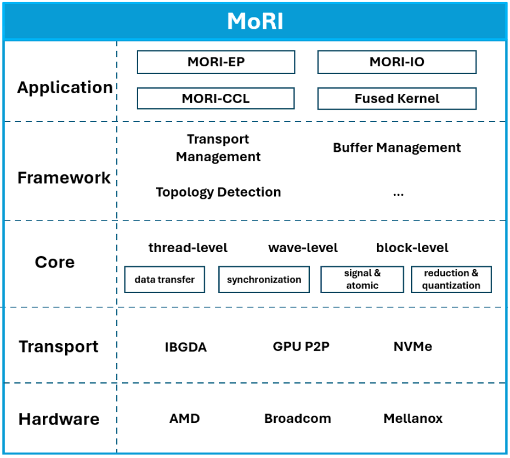

# MORI



**MORI** (**Mo**dular **R**DMA **I**nterface) is a **bottom-up, modular, and composable framework** for building high-performance communication applications with a strong focus on **RDMA + GPU integration**. Inspired by the role of MLIR in compiler infrastructure, MORI provides reusable and extensible building blocks that make it **easier for developers to adopt advanced techniques** such as IBGDA (Infiniband GPUDirect Async) and GDS (GPUDirect Storage).

To help developers get started quickly, MORI also includes a suite of optimized libraries—**MORI-EP** (MoE dispatch & combine kernels), **MORI-IO** (p2p communication for KVCache transfer), and **MORI-CCL** (collective communication)—that deliver out-of-the-box performance.

Feature summary:
- Applications
    - MORI-EP: intra and inter-node dispatch/combine kernels with SOTA performance
    - MORI-IO: point-to-point communication library with ultra-low overhead
    - MORI-CCL: lightweight and felxible collective communication library designed for highly customized use cases such as latency-sensitive or resource-constrained envrionment
- Framework
    - High-performance building blocks for IBGDA / P2P and more​ 
    - Modular & composable components for developing communication applications, such as transport management, topology detection and etc.
    - Shmem-style APIs  
    - C++ level APIs
    - Python level APIs

## Benchmarks

Configurations:
- Hardware: 8 x MI300X per node, with 8 single-port CX7 400Gb/s RDMA NICs
- Software: ROCm 6.4.0

### MORI-EP 

Benchmark result on DeepSeek V3 model configurations:

4096 tokens per batch, 7168 hidden, top-8 experts, FP8 dispatching and BF16 combining

| **Kernels**| **# CUs**| **Dispatch** | **Combine** |
|------------|----------|--------------|-------------|
|EP8         | 80       | 307 GB/s     | 285 GB/s    |
|EP16        | 32       | 75 GB/s      | 76 GB/s     |
|EP16        | 80       | 79 GB/s      | 82 GB/s     |


### MORI-IO (Preview)

**NOTE**: This is the preview version of MORI-IO Benchmark performance, we will soon merge MORI-IO into main branch

Benchmark result on the following configurations:
- Operation: GPU direct RDMA READ
- Mode: pairwise
- Number of consecutive Transfer: 64
- Number of GPUs: 1

| **Msg Size** | **Total Size** | **Read** | **Session Read** | **Batch Read** | **Session Batch Read** |
|-|-|-|-|-|-|
8 KB | 0.5 MB | 0.08 | 2.51 | 3.87 | 8.52 |
32 KB | 2 MB | 0.37 | 10.30 | 12.11 | 26.34 |
128 KB | 8 MB | 1.59 | 37.55 | 27.95 | 38.66 |
512 KB | 32 MB | 6.24 | 43.08 | 35.91 | 43.03 |

- Session is a specific techinique used in MORI-IO to reduce overhead

## Installation

### Prerequsites

- pytorch:rocm >= 6.4.0
- Linux packages: see packages in dockerfile

Or build docker image with:
```
cd mori && docker build -t rocm/mori:dev -f docker/Dockerfile.dev .
```

### Install with Python
```
cd mori && git submodule update --init --recursive && pip3 install .
```

### Test dispatch / combine
```
cd /path/to/mori
export PYTHONPATH=/path/to/mori:$PYTHONPATH

# Test correctness
pytest tests/python/ops/

# Benchmark performance
python3 tests/python/ops/bench_dispatch_combine.py 
```

### Test MORI-IO
```
cd /path/to/mori
export PYTHONPATH=/path/to/mori:$PYTHONPATH

# Test correctness
pytest tests/python/io/

# Benchmark performance
# Run the following command on two nodes
export GLOO_SOCKET_IFNAME=ens14np0
torchrun --nnodes=2 --node_rank=0 --nproc_per_node=1 --master_addr="10.194.129.65" --master_port=1234 tests/python/io/benchmark.py --host="10.194.129.65" --enable-batch-transfer --enable-sess --buffer-size 32768 --transfer-batch-size 128
```