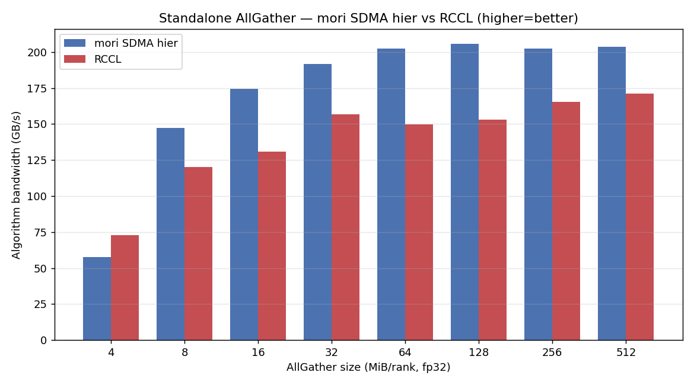
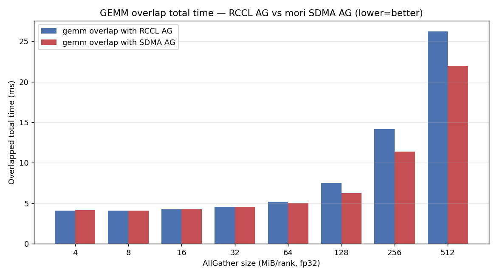

# Hierarchical cross-node AllGather (intra-node SDMA + inter-node RDMA)

## Summary

This change adds a **hierarchical AllGather** to MORI-CCL that keeps intra-node
traffic on the GPU **SDMA copy engines** (XGMI) and moves inter-node traffic
over **RDMA** (the NIC), exposed as `mori.ccl.HierAllGather` with an
`all_gather_into_tensor`-compatible signature.

The motivation is **compute/communication overlap (通算并行)**: because the
collective runs on the dedicated SDMA copy engines instead of the compute units,
an AllGather issued concurrently with a GEMM does **not** steal CUs from the
GEMM. The result is parity with RCCL for a standalone AllGather, and a strict win
when overlapped with compute.

- Intra-node phase: SDMA sub-group gather over XGMI (no CU usage, no NIC).
- Inter-node phase: RDMA ring exchange of node-blocks over the NIC.
- A fused `ring || local-gather` kernel runs the inter-node RDMA ring and the
  ring-independent local node-block SDMA gather concurrently in a single grid,
  with stream-ordered fences and a direct-to-output path (no staging copy).
- Correctness: **bit-exact** vs `torch.distributed.all_gather_into_tensor`
  (zero tolerance) for `{bf16, fp16, fp32, int32}` across all tested sizes.

## API

```python
from mori.ccl import HierAllGather

ag = HierAllGather(
    my_pe=rank, npes=world_size, ranks_per_node=local_world_size,
    input_buffer_size=per_rank_bytes,
    output_buffer_size=per_rank_bytes * world_size,
    copy_output_to_user=True,
)
ag(input_tensor, output_tensor, numel, stream)   # intra=SDMA, inter=RDMA
```

## Results

Measured on **2 nodes × 4 GPUs = 8 ranks** (AMD Instinct MI355X / gfx950,
intra-node XGMI, inter-node RDMA NIC), fp32, ≥3 timed reps (min), algorithm
bandwidth = total output bytes / time. RCCL baseline is PyTorch
`torch.distributed.all_gather_into_tensor` on the NCCL/RCCL backend, measured
back-to-back in the same process with the same inputs and timing.

### 1. Standalone AllGather — mori ≥ RCCL

| size | mori GB/s | rccl GB/s | ratio |
|-----:|----------:|----------:|------:|
| 4 MB   | 57.5  | 72.8  | 0.79 |
| 8 MB   | 147.2 | 120.1 | 1.23 |
| 16 MB  | 174.4 | 130.8 | 1.33 |
| 32 MB  | 191.6 | 156.8 | 1.22 |
| 64 MB  | 202.3 | 149.8 | 1.35 |
| 128 MB | 205.9 | 153.0 | 1.35 |
| 256 MB | 202.5 | 165.4 | 1.22 |
| 512 MB | 203.5 | 171.0 | 1.19 |

mori ≥ RCCL for every size ≥ 8 MB (1.19–1.35×). 4 MB is latency-bound.



### 2. Under concurrent GEMM (overlap) — mori SDMA strictly faster

Total wall time (ms, lower is better) of a GEMM loop run concurrently with the
AllGather, comparing RCCL AG vs mori SDMA AG:

| size | gemm + RCCL AG (ms) | gemm + SDMA AG (ms) | SDMA advantage |
|-----:|--------------------:|--------------------:|---------------:|
| 16 MB  | 4.27  | 4.26  | faster |
| 32 MB  | 4.59  | 4.55  | faster |
| 64 MB  | 5.19  | 5.03  | ~3% |
| 128 MB | 7.52  | 6.27  | ~17% |
| 256 MB | 14.15 | 11.38 | ~20% |
| 512 MB | 26.24 | 21.97 | ~16% |

Because SDMA uses copy engines while RCCL consumes CUs that the GEMM needs, the
SDMA AllGather overlaps with compute far better — 16–20% lower total time at
large sizes.



Raw data: `benchmarks/allgather_results/sweep_standalone.csv`,
`benchmarks/allgather_results/sweep_gemm_overlap.csv`.

## Reproduce

```bash
# build (in-place)
python3 setup.py build_ext --inplace
export PYTHONPATH=$PWD:$PWD/python:$PYTHONPATH MORI_ENABLE_SDMA=1

# correctness (true 2-node, world=8): bit-exact vs torch
torchrun --nnodes=2 --nproc_per_node=4 --master_addr=<ip> --master_port=29500 \
  tests/python/ccl/test_hier_allgather.py

# size sweeps -> CSV + charts
torchrun --nnodes=2 --nproc_per_node=4 ... tests/python/ccl/bench_sweep.py
torchrun --nnodes=2 --nproc_per_node=4 ... tests/python/ccl/bench_gemm_overlap.py
python3 tests/python/ccl/plot_sweeps.py
```

## Files

- `include/mori/collective/allgather/` — intra-node SDMA sub-group gather/broadcast
- `include/mori/collective/inter_node/` — inter-node RDMA ring + fused kernel
- `python/mori/ccl/hier_allgather.py` — `HierAllGather` host orchestration
- `src/pybind/pybind_ccl.cpp`, `python/mori/ccl/` — Python bindings/API
- `tests/python/ccl/test_hier_allgather*.py` — bit-exact correctness
- `tests/python/ccl/bench_sweep.py`, `bench_gemm_overlap.py`, `plot_sweeps.py` — benches + charts
