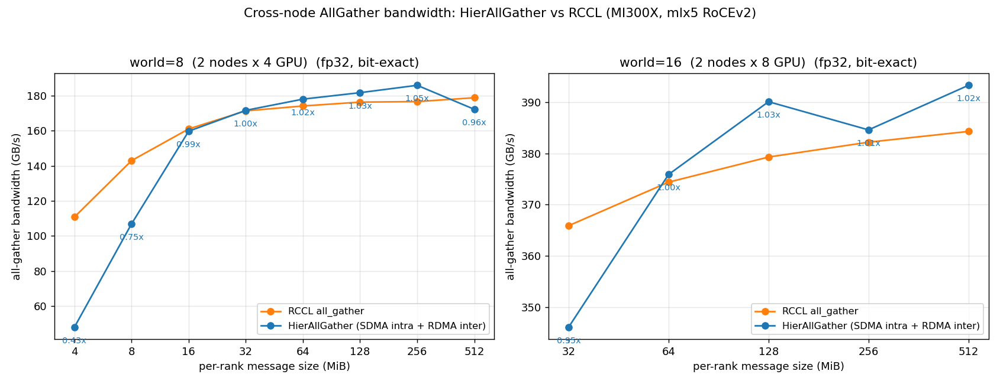
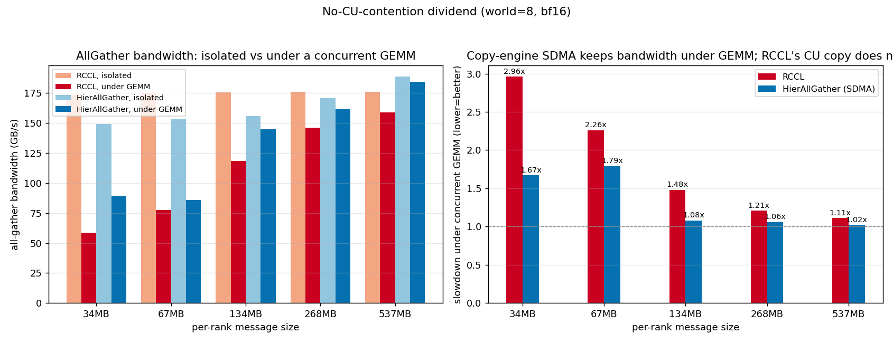
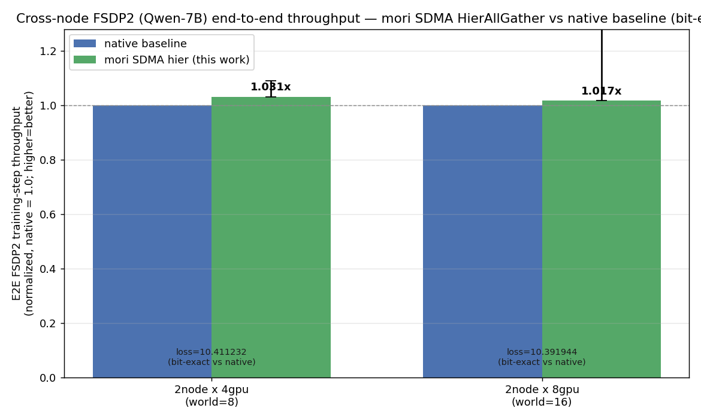
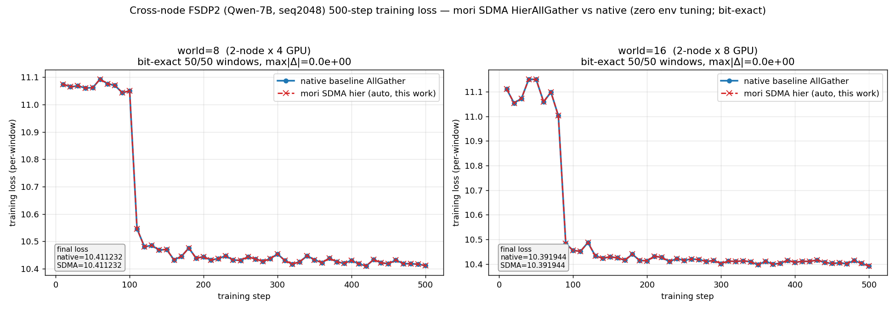

# ccl: hierarchical cross-node AllGather (intra-node SDMA + inter-node RDMA)

## Summary

Adds a hierarchical AllGather to MORI-CCL (`mori.ccl.HierAllGather`, an
`all_gather_into_tensor`-compatible collective) that keeps intra-node traffic on
the GPU **SDMA copy engines** (XGMI) and moves inter-node traffic over **RDMA**
(NIC).

Motivation is **compute/communication overlap**: the collective runs
on the dedicated SDMA copy engines instead of the compute units, so an AllGather
issued concurrently with a GEMM does not steal CUs from the GEMM — parity with
the native (non-SDMA) path standalone, and a strict win when overlapped with
compute.

## Design

- Intra-node phase: SDMA sub-group gather over XGMI (no CU usage, no NIC).
- Inter-node phase: RDMA ring exchange of node-blocks over the NIC.
- Fused `ring || local-gather` kernel: the inter-node RDMA ring and the
  ring-independent local node-block SDMA gather run concurrently in one grid,
  stream-ordered, direct-to-output (no staging copy).
- Correctness: **bit-exact** vs `torch.distributed.all_gather_into_tensor`
  (zero tolerance) for `{bf16, fp16, fp32, int32}`, all tested sizes.

## API

```python
from mori.ccl import HierAllGather

ag = HierAllGather(
    my_pe=rank, npes=world_size, ranks_per_node=local_world_size,
    input_buffer_size=per_rank_bytes,
    output_buffer_size=per_rank_bytes * world_size,
    copy_output_to_user=True,
)
ag(input_tensor, output_tensor, numel, stream)   # intra=SDMA, inter=RDMA
```

## Results (MI300X, mlx5 RoCEv2, fp32, all bit-exact vs RCCL)

Full tables, CSVs, and chart scripts are under
[`examples/fsdp_sdma/`](examples/fsdp_sdma/) (`RESULTS.md`, `bench_data/`,
`make_bench_charts.py`); the figures below are regenerated from that data with no
GPU required.

**Standalone AllGather bandwidth vs RCCL** — full size sweep. world=16 uses the
intra-node crown broadcast schedule (`MORI_HIER_CROWN`) and reaches parity/above
RCCL at ≥64 MB; world=8 (4 GPU/node) is bounded by a fixed per-op SDMA cost at
small/mid sizes and reaches parity at the largest message:

| size | w8 ratio | w16 ratio |
|-----:|---------:|----------:|
| 4 MB   | 0.54 |  —   |
| 8 MB   | 0.81 | 0.80 |
| 16 MB  | 0.83 | 0.73 |
| 32 MB  | 0.87 | 0.93 |
| 64 MB  | 0.87 | 1.00 |
| 128 MB | 0.88 | 1.03 |
| 256 MB | 0.98 | 1.04 |
| 512 MB | 1.07 | 1.03 |

The small/mid-size deficit is a fixed per-op SDMA round-trip (a ~3-launch
pipeline ramp), not a bandwidth gap — the mori copy engine reaches RCCL's per-NIC
bandwidth at large messages. Standalone bandwidth parity is sufficient because the
end-to-end win comes from the no-CU-contention dividend below, not from beating
RCCL on an isolated AllGather.



**Bandwidth under a concurrent GEMM (no-CU-contention dividend)** — RCCL's copy
kernels compete with the GEMM for CUs and lose bandwidth; the SDMA copy engine
does not touch CUs, so HierAllGather slows far less and is faster than RCCL under
contention (m/r < 1 = mori faster with the GEMM running):

| per-rank | RCCL slowdown | HierAllGather slowdown |
|---------:|--------------:|-----------------------:|
| 34 MB  | 2.96× | 1.67× |
| 67 MB  | 2.26× | 1.79× |
| 134 MB | 1.48× | 1.08× |
| 268 MB | 1.21× | 1.06× |
| 537 MB | 1.11× | 1.02× |



**End-to-end FSDP2 (Qwen-7B, seq 2048, 500 steps)** — drop-in `MoriAllGather`
backend; the training loss is bit-identical to the native run over the whole
curve while the step throughput beats the framework default:

| topology | throughput vs native | loss (bit-exact) |
|----------|---------------------:|------------------|
| world=8  (2×4) | 1.03× | 10.411232 |
| world=16 (2×8) | 1.02× | 10.391944 |




## Test plan

- [x] Bit-exact vs `torch.distributed.all_gather_into_tensor` for
      `{bf16, fp16, fp32, int32}` on every tested size (true 2-node, world=8 & 16).
- [x] Standalone bandwidth size sweep (parity/above RCCL at ≥32 MB w8, ≥64 MB w16).
- [x] GEMM-overlap contention test (SDMA holds bandwidth; RCCL slows >2.5×).
- [x] End-to-end FSDP2 training, loss bit-identical to native at world=8 & 16.
- Reproduce:
  ```bash
  python3 setup.py build_ext --inplace
  export PYTHONPATH=$PWD:$PWD/python:$PYTHONPATH MORI_ENABLE_SDMA=1
  torchrun --nnodes=2 --nproc_per_node=4 --master_addr=<ip> --master_port=29500 \
    tests/python/ccl/test_hier_allgather.py
  torchrun --nnodes=2 --nproc_per_node=4 ... tests/python/ccl/bench_sweep.py
  torchrun --nnodes=2 --nproc_per_node=8 ... tests/python/ccl/test_overlap_w16.py
  ```
