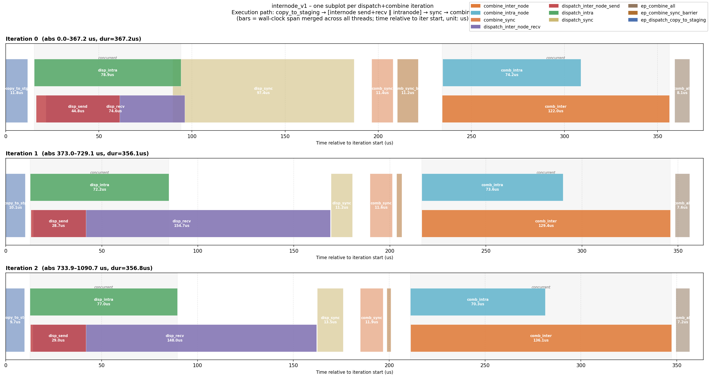

# MORI-EP Benchmark

## Table of Contents

- [Intra-node](#intra-node)
- [Inter-node](#inter-node)
- [NIC Selection](#nic-selection)
- [Bandwidth Computation](#bandwidth-computation)
- [Profiling EP Kernels](#profiling-ep-kernels)

## Intra-node

```bash
cd /path/to/mori
export PYTHONPATH=/path/to/mori:$PYTHONPATH

# Benchmark performance
python3 tests/python/ops/bench_dispatch_combine.py
```

## Inter-node

Run the following command on each node and replace `node_rank` with its actual rank. `master_addr` should be the IP of the rank 0 node. `GLOO_SOCKET_IFNAME` should be set to the TCP socket interface you want to use.

```bash
export GLOO_SOCKET_IFNAME=ens14np0
export MORI_RDMA_DEVICES=^mlx5_0,mlx5_1  # Optional: use `^` prefix to exclude specified devices
export GPU_PER_NODE=8

# nproc_per_node=1: the script spawns GPU_PER_NODE worker processes internally via torch.multiprocessing.spawn
torchrun --nnodes=2 --node_rank=0 --nproc_per_node=1 \
    --master_addr="10.194.129.65" --master_port=1234 \
    examples/ops/dispatch_combine/test_dispatch_combine_internode.py \
    --cmd bench --num-qp 2
```

## Bandwidth Computation

Two fabrics are measured: **RDMA** (inter-node) and **NVL/XGMI** (intra-node).

---

### RDMA bandwidth

**What it measures:** For each token, count how many distinct nodes it needs to be sent to. Multiply that total count by the token size to get the bytes transferred over the inter-node network.

#### Algo BW vs Physical BW

The kernel allocates buffer slots for **all** destination nodes including the local node, so the "algo" token count includes local-node destinations even though those bytes never actually travel over RDMA (they go over NVLink/XGMI instead). The "physical" count excludes the local node:

```
physical_tokens = algo_tokens × (num_nodes - 1) / num_nodes
physical_bw     = algo_bw     × (num_nodes - 1) / num_nodes
```

Both DeepEP and Mori report the **algo** figure. The physical figure is `print_bw_values.py`'s `num_rdma_token_sent (physical)`.

|  | DeepEP | Mori |
|--|--------|------|
| **Token count** | `num_rdma_token_sent = rdma_idx.ne(-1).sum()` where `rdma_idx = topk_idx // (num_experts // num_nodes)`, deduplicated per token | `total_rdma_recv_num_token = compute_rdma_algo_token_count(topk_idx, ...)` — same logic, vectorised with `scatter_` |
| **Bytes** | `num_rdma_token_sent × hidden × 2` (BF16) | `total_rdma_recv_num_token × hidden_dim × element_size` |
| **BW** | `rdma_bytes / 1e9 / t` | `rdma_bytes / 1000³ / (t_ms / 1000)` |

---

### NVL / XGMI bandwidth

**What it measures:** The number of tokens this rank actually received (from peers on the same node and forwarded from other nodes), multiplied by the token size. This reflects real data landed in local GPU memory via the intra-node fabric.

|  | DeepEP | Mori |
|--|--------|------|
| **Token count** | `recv_x.numel() / hidden` — size of the received tensor after dispatch | `total_recv_num_token` from `dispatch_recv_num_token[0]` returned by the kernel |
| **Bytes** | `recv_x.numel() × 2` (BF16) | `total_recv_num_token × hidden_dim × element_size` |
| **BW** | `nvl_bytes / 1e9 / t` | `nvl_bytes / 1000³ / (t_ms / 1000)` |

---

### Why DeepEP and Mori RDMA token counts are equivalent

Both compute the same quantity — unique `(token, destination-node)` pairs — just with different data structures.

**Step 1: same divisor.**
Both map an expert ID to a node ID by dividing by the number of experts per node:

```
DeepEP: rdma_idx  = topk_idx // (num_experts // num_nodes)
Mori:   node_idx  = topk_idx // (num_experts_per_rank × gpu_per_node)
```

`num_experts // num_nodes` and `num_experts_per_rank × gpu_per_node` are identical — both equal experts per node.

**Step 2: same deduplication.**
Each token can map to the same node via multiple expert slots; both implementations collapse those duplicates:

- DeepEP: `inplace_unique(rdma_idx, num_nodes)` rewrites each token row in-place, replacing duplicates with -1.
- Mori: `node_presence.scatter_(1, node_idx, True)` writes into a `[T, num_nodes]` boolean matrix, so hitting the same node twice is a no-op.

Both produce exactly the set of unique nodes visited by each token.

**Step 3: same counting.**
- DeepEP: `rdma_idx.ne(-1).sum()` counts non-empty slots in the deduped rows.
- Mori: `node_presence.sum()` counts `True` entries in the boolean matrix.

The results are identical.

**Step 4: validate by program.**

Run each tool and compare the RDMA token count for the same configuration.

*DeepEP* — use `print_bw_values.py`, which prints both algo and physical counts per rank. Note: this script replicates DeepEP's data generation and token-count logic exactly (mirroring `test_internode.py`) so the numbers are directly comparable. The full script is listed in the [Reference section](#reference-print_bw_valuespy) at the bottom of this document.
```
python DeepEP/tests/print_bw_values.py --num-nodes 2 --gpu-per-node 8 --num-tokens 4096 \
       --hidden 7168 --num-experts 256 --num-topk 8
```
Look for the line:
```
  num_rdma_token_sent (algo)    = 8166  (all node-destinations incl. local — matches original)
```

*Mori* — run the bench script with `--cmd bench`:
```
GPU_PER_NODE=8 torchrun --nnodes=2 --node_rank=0 --nproc_per_node=1 ... \
    test_dispatch_combine_internode.py --max-tokens 128 --cmd bench --num-qp 2
```
Look for the line printed by `run_bench_once` (line 786):
```
rank 8 recv 26757 tokens 8166 rdma tokens
```

The `8166 rdma tokens` value is the algo RDMA token count and should match the DeepEP figure for the same routing configuration.

---

### Combine

Combine is symmetric to dispatch — same byte counts, reversed direction:

- RDMA recv bytes = dispatch RDMA send bytes
- NVL/XGMI send bytes = dispatch NVL/XGMI recv bytes

---

### Reference: `print_bw_values.py`

```python
"""
Standalone script to print DeepEP internode bandwidth-related values
without running any deep_ep kernels.

Mirrors the routing logic of test_internode.py and computes:
  - num_rdma_token_sent  (= rdma_idx.ne(-1).sum())
  - recv_x_numel         (= gbl_num_tokens_per_rank[rank] * hidden)
  - dispatch RDMA bytes / NVL bytes
  - combine RDMA bytes / NVL bytes
  - fp8-adjusted variants

Uses gloo (CPU) backend so any number of logical ranks can be simulated
on however many physical GPUs are available.

Usage:
  python print_bw_values.py [--num-nodes N] [--gpu-per-node G]
                            [--num-tokens T] [--hidden H]
                            [--num-experts E] [--num-topk K]
"""

import argparse
import os
import sys
import torch
import torch.distributed as dist


def inplace_unique(x: torch.Tensor, num_slots: int):
    # Exact copy of DeepEP/tests/utils.py — device=x.device preserved
    assert x.dim() == 2
    mask = x < 0
    x_padded = x.masked_fill(mask, num_slots)
    bin_count = torch.zeros((x.size(0), num_slots + 1), dtype=x.dtype, device=x.device)
    bin_count.scatter_add_(1, x_padded, torch.ones_like(x_padded))
    bin_count = bin_count[:, :num_slots]
    sorted_bin_count, sorted_bin_idx = torch.sort(bin_count, dim=-1, descending=True)
    sorted_bin_idx.masked_fill_(sorted_bin_count == 0, -1)
    sorted_bin_idx = torch.sort(sorted_bin_idx, descending=True, dim=-1).values
    x[:, :].fill_(-1)
    valid_len = min(num_slots, x.size(1))
    x[:, :valid_len] = sorted_bin_idx[:, :valid_len]


def create_grouped_scores(scores: torch.Tensor, group_idx: torch.Tensor, num_groups: int):
    # Exact copy of DeepEP/tests/utils.py
    num_tokens, num_experts = scores.shape
    scores = scores.view(num_tokens, num_groups, -1)
    mask = torch.zeros((num_tokens, num_groups), dtype=torch.bool, device=scores.device)
    mask = mask.scatter_(1, group_idx, True).unsqueeze(-1).expand_as(scores)
    return (scores * mask).view(num_tokens, num_experts)


def worker(local_rank: int, num_processes: int, args: argparse.Namespace):
    rank         = local_rank
    world_size   = num_processes
    num_nodes    = args.num_nodes
    gpu_per_node = args.gpu_per_node
    assert world_size == num_nodes * gpu_per_node

    dist.init_process_group(
        backend='gloo',        # CPU-only; no NCCL needed, no GPU conflicts
        init_method=f'tcp://127.0.0.1:{args.port}',
        world_size=world_size,
        rank=rank,
    )

    num_tokens      = args.num_tokens
    hidden          = args.hidden
    num_experts     = args.num_experts
    num_topk        = args.num_topk
    num_ranks       = world_size
    num_topk_groups = min(num_nodes, 4)

    torch.manual_seed(rank)

    # ---- Mirror test_internode.py "Random data" block exactly ------------
    # Original line 36: x_pure_rand is generated BEFORE scores, advancing RNG.
    # We replicate this so scores sees the same RNG state as in the original.
    _ = torch.randn((num_tokens, hidden), dtype=torch.bfloat16)   # matches x_pure_rand
    # Original line 40:
    scores = torch.randn((num_tokens, num_experts), dtype=torch.float32).abs() + 1
    # Original line 41:
    group_scores = scores.view(num_tokens, num_nodes, -1).amax(dim=-1)
    # Original line 42:
    group_idx = torch.topk(group_scores, k=num_topk_groups, dim=-1, sorted=False).indices
    # Original line 43:
    masked_scores = create_grouped_scores(scores, group_idx, num_nodes)
    # Original line 44:
    topk_idx = torch.topk(masked_scores, num_topk, dim=-1, largest=True, sorted=False)[1]
    # Original line 45: deep_ep.topk_idx_t == torch.int64 (TOPK_IDX_BITS=64 by default)
    topk_idx = topk_idx.to(torch.int64)

    # ---- Mirror test_internode.py lines 48-54 ----------------------------
    # Original line 48: rank_idx = topk_idx // (num_experts // num_ranks)
    rank_idx = topk_idx // (num_experts // num_ranks)
    # Original line 49: rank_idx = rank_idx.to(torch.int64)  (no-op: already int64)
    rank_idx = rank_idx.to(torch.int64)
    # Original line 50:
    rank_idx.masked_fill_(topk_idx == -1, -1)
    # Original line 51:
    inplace_unique(rank_idx, num_ranks)
    # Original line 52: rdma_rank_idx = rank_idx // num_local_ranks
    rdma_rank_idx = rank_idx // gpu_per_node
    # Original line 53:
    rdma_rank_idx.masked_fill_(rank_idx == -1, -1)
    # Original line 54:
    inplace_unique(rdma_rank_idx, num_nodes)

    # ---- Mirror test_internode.py lines 58-61 (RDMA dispatch counts) -----
    # Original line 58: rdma_idx = topk_idx // (num_experts // num_nodes)
    rdma_idx = topk_idx // (num_experts // num_nodes)
    # Original line 59:
    rdma_idx.masked_fill_(topk_idx == -1, -1)
    # Original line 60:
    inplace_unique(rdma_idx, num_nodes)
    # Original line 61: counts ALL (token, node) pairs including local node
    num_rdma_token_sent = rdma_idx.ne(-1).sum().item()

    # Physical cross-node count (not in original; added for comparison)
    my_node = rank // gpu_per_node
    rdma_idx_cross = rdma_idx.clone()
    rdma_idx_cross.masked_fill_(rdma_idx_cross == my_node, -1)
    num_rdma_token_sent_physical = rdma_idx_cross.ne(-1).sum().item()

    # ---- Mirror test_internode.py lines 71-86 (rank layout meta) ---------
    # Original line 71: num_tokens_per_rank = torch.empty((num_ranks,), dtype=torch.int, ...)
    num_tokens_per_rank = torch.empty((num_ranks,), dtype=torch.int)
    # Original lines 74-75:
    for i in range(num_ranks):
        num_tokens_per_rank[i] = (rank_idx == i).sum()
    # Original line 85:
    gbl_num_tokens_per_rank = num_tokens_per_rank.clone()
    # Original line 86:
    dist.all_reduce(gbl_num_tokens_per_rank)

    recv_num_tokens = gbl_num_tokens_per_rank[rank].item()
    recv_x_numel    = recv_num_tokens * hidden

    # byte counts
    dispatch_bf16_rdma_send_bytes = num_rdma_token_sent * hidden * 2
    dispatch_bf16_nvl_recv_bytes  = recv_x_numel * 2
    combine_bf16_nvl_send_bytes   = dispatch_bf16_nvl_recv_bytes
    combine_bf16_rdma_recv_bytes  = dispatch_bf16_rdma_send_bytes

    fp8_factor = (1 + 4 / 128) / 2
    dispatch_fp8_rdma_send_bytes = dispatch_bf16_rdma_send_bytes * fp8_factor
    dispatch_fp8_nvl_recv_bytes  = dispatch_bf16_nvl_recv_bytes  * fp8_factor

    dist.barrier()
    for r in range(num_ranks):
        if rank == r:
            node = rank // gpu_per_node
            gpu  = rank %  gpu_per_node
            print(f"\n[rank {rank:2d}  node={node} gpu={gpu}]")
            print(f"  num_tokens sent               = {num_tokens}")
            print(f"  recv_num_tokens               = {recv_num_tokens}")
            print(f"  recv_x_numel                  = {recv_x_numel:,}  ({recv_x_numel*2/1e9:.4f} GB BF16)")
            phys_ratio = num_rdma_token_sent_physical / num_rdma_token_sent if num_rdma_token_sent else 0
            print(f"  num_rdma_token_sent (algo)    = {num_rdma_token_sent}  (all node-destinations incl. local — matches original)")
            print(f"  num_rdma_token_sent (physical)= {num_rdma_token_sent_physical}  (cross-node only, ratio={phys_ratio:.3f})")
            print(f"  -- BF16 algorithm bandwidth bytes (as reported by original) --")
            print(f"  dispatch RDMA send (algo)     = {dispatch_bf16_rdma_send_bytes:>14,}  ({dispatch_bf16_rdma_send_bytes/1e9:.4f} GB)")
            print(f"  dispatch RDMA send (physical) = {int(dispatch_bf16_rdma_send_bytes*phys_ratio):>14,}  ({dispatch_bf16_rdma_send_bytes*phys_ratio/1e9:.4f} GB,  algo*{phys_ratio:.3f})")
            print(f"  dispatch NVL  recv            = {dispatch_bf16_nvl_recv_bytes:>14,}  ({dispatch_bf16_nvl_recv_bytes/1e9:.4f} GB)")
            print(f"  combine  RDMA recv (algo)     = {combine_bf16_rdma_recv_bytes:>14,}  ({combine_bf16_rdma_recv_bytes/1e9:.4f} GB)")
            print(f"  combine  NVL  send            = {combine_bf16_nvl_send_bytes:>14,}  ({combine_bf16_nvl_send_bytes/1e9:.4f} GB)")
            print(f"  -- FP8 (factor={fp8_factor:.5f}) --")
            print(f"  dispatch RDMA send (algo)     = {dispatch_fp8_rdma_send_bytes:>14,.0f}  ({dispatch_fp8_rdma_send_bytes/1e9:.4f} GB)")
            print(f"  dispatch NVL  recv            = {dispatch_fp8_nvl_recv_bytes:>14,.0f}  ({dispatch_fp8_nvl_recv_bytes/1e9:.4f} GB)")
            sys.stdout.flush()
        dist.barrier()

    dist.destroy_process_group()


if __name__ == '__main__':
    parser = argparse.ArgumentParser()
    parser.add_argument('--num-nodes',    type=int, default=1)
    parser.add_argument('--gpu-per-node', type=int, default=8)
    parser.add_argument('--num-tokens',   type=int, default=4096)
    parser.add_argument('--hidden',       type=int, default=7168)
    parser.add_argument('--num-experts',  type=int, default=256)
    parser.add_argument('--num-topk',     type=int, default=8)
    parser.add_argument('--port',         type=int, default=29501)
    args = parser.parse_args()

    num_processes = args.num_nodes * args.gpu_per_node
    print(f"Simulating {args.num_nodes} node(s) × {args.gpu_per_node} GPUs = {num_processes} ranks")
    print(f"num_tokens={args.num_tokens}, hidden={args.hidden}, "
          f"num_experts={args.num_experts}, num_topk={args.num_topk}, "
          f"num_topk_groups={min(args.num_nodes,4)}")
    torch.multiprocessing.spawn(worker, args=(num_processes, args), nprocs=num_processes)
```

---

## Profiling EP Kernels

Mori ships a profiler that emits Perfetto-compatible JSON traces for each EP kernel invocation.

**1. Build with profiler enabled**

```bash
cd /apps/ditian12/mori
ENABLE_PROFILER=ON pip3 install -e . --no-build-isolation -v
```

**2. Clear the JIT cache**

```bash
rm -rf ~/.mori
```

**3. Run the profiling job**

Run on each node, substituting `node_rank` and `master_addr` as in the [Inter-node](#inter-node) section.  Use `--cmd profile` and pass the desired kernel type via `--kernel-type`:

```bash
export GLOO_SOCKET_IFNAME=ens14np0
export MORI_RDMA_DEVICES=^mlx5_0,mlx5_1  # optional
export GPU_PER_NODE=8

# nproc_per_node=1: the script spawns GPU_PER_NODE worker processes internally via torch.multiprocessing.spawn
torchrun --nnodes=2 --node_rank=0 --nproc_per_node=1 \
    --master_addr="10.194.129.65" --master_port=1234 \
    examples/ops/dispatch_combine/test_dispatch_combine_internode.py \
    --cmd profile --kernel-type v1 --num-qp 2
```

Repeat for `--kernel-type v1_ll` and `--kernel-type async_ll`.  **Note:** `async_ll` requires `MORI_ENABLE_SDMA=1`; all other kernel types require `MORI_ENABLE_SDMA=0`:

```bash
# async_ll
MORI_ENABLE_SDMA=1 torchrun --nnodes=2 --node_rank=0 --nproc_per_node=1 \
    --master_addr="10.194.129.65" --master_port=1234 \
    examples/ops/dispatch_combine/test_dispatch_combine_internode.py \
    --cmd profile --kernel-type async_ll --num-qp 2
```

Traces land as `trace_rank_<rank>_<timestamp>.json` in the current working directory.

### Analyzing traces with `analyze_ep_kernel_trace.py`

[tools/profiler/analyze_ep_kernel_trace.py](../tools/profiler/analyze_ep_kernel_trace.py) parses a single `trace_rank_*.json` file and produces a Gantt-style PNG showing how EP kernels overlap within each dispatch+combine iteration.

**Usage**

```bash
python3 tools/profiler/analyze_ep_kernel_trace.py \
    /apps/ditian12/mori/profile/v1/trace_rank_0_<timestamp>.json \
    --out timeline_v1.png
```

The script prints a text summary and saves the PNG next to the trace file by default.

**Example output**

The plot has one subplot per iteration.  Each subplot shows:

- **Serial kernels** (full-height bars): `copy_to_staging` at the left, `dispatch_sync` and `combine_sync` as barriers between phases, and `combine_all` at the right.
- **Internode lane** (red/purple bars): `disp_send` and `disp_recv` during the dispatch phase, `comb_inter` during the combine phase.
- **Intranode lane** (green/teal bars): `disp_intra` and `comb_intra` running concurrently with the internode lane (grey shaded region labelled *concurrent*).
- **Bar width** is wall-clock duration in microseconds, relative to the start of each iteration.



**What the output shows**

Each subplot corresponds to one dispatch+combine iteration.  Kernels are assigned to semantic lanes:

| Lane | Kernels |
|------|---------|
| internode | `dispatch_inter_node_{send,recv}`, `combine_inter_node` (and `_ll` variants) |
| intranode | `dispatch_intra`, `combine_intra_node` (and `_ll` variants) |
| serial (full-height) | `ep_dispatch_copy_to_staging`, `dispatch_sync`, `combine_sync`, `ep_combine_all` |

The grey shaded region labelled **concurrent** marks where internode and intranode kernels overlap.  Bar width is wall-clock duration in microseconds.

**Text summary**

The script also prints per-iteration kernel start/end/duration and aggregate per-thread duration stats (mean, min, max, call count) across all iterations, which is useful for spotting outlier iterations or load-imbalance between threads.
