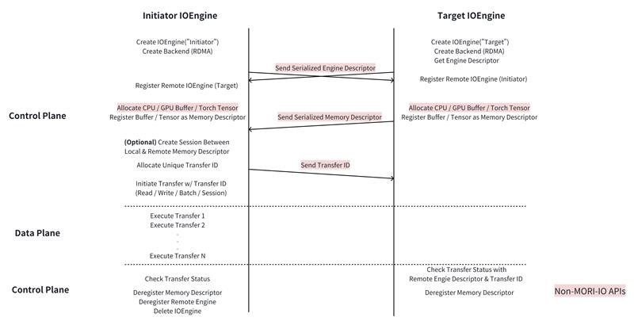
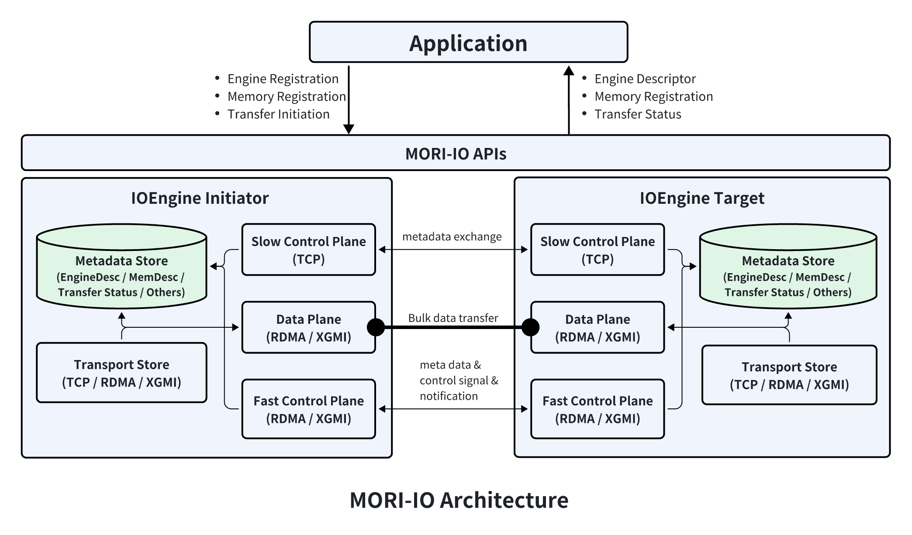

# MORI-IO Introduction

MORI-IO is AMD's point-to-point communication library that leverages GDR (GPU Direct RDMA) to achieve low-latency and high-bandwidth. Its current main use case is KVCache transfer in LLM inference.

## Table of Contents

- [Design & Concepts](#design--concepts)
- [Workflow](#workflow)
- [Architecture](#architecture)
- [Python API Quick Reference](#python-api-quick-reference)
- [Example: Basic Read/Write](#example-basic-readwrite)
- [Environment & Configuration](#environment--configuration)
- [Source Files](#source-files)

## Design & Concepts

- **IOEngine**: The primary interface for interacting with MORI-IO. It abstracts low-level details of P2P communications and provides high-level APIs for engine registration, memory registration, P2P transfer, etc.
- **Backend**: A backend represents and manages a specific transfer medium (e.g., RDMA, XGMI, TCP). It must be created before any data transfer can occur over that medium.
- **Engine Registration**: Before two engines can communicate, the remote engine must be registered with the local engine. This establishes the necessary context for initiating data transfers between them.
- **Memory Registration**: Application memory must be registered with a local engine before it can participate in data transfer. This ensures the engine can access and manage the memory efficiently during communication.
- **Read/Write**: One-sided transfer operations initiated by the initiator engine without active involvement from the target engine. These operations can move data directly between registered memory regions.
- **Batch Read/Write**: A batched form of one-sided operations, where multiple transfers are grouped and launched together. Batching reduces per-operation launch overhead and improves bandwidth utilization.
- **Session**: A pre-established transfer context between a pair of MemoryDesc objects. Sessions eliminate repetitive overheads such as connection setup, metadata exchange, and resource management, providing a lightweight and efficient path for repeated transfers.

## Workflow

The image below shows a typical workflow of using MORI-IO.



## Architecture

From the application's perspective, MORI-IO provides 3 kinds of functionalities: engine registration, memory registration, and transfers.

The application is responsible for passing and registering engine descriptors among engines where transfers are expected to happen. Once engines are registered with each other, the application registers memory buffers on both initiator-side and target-side. Before initiating transfers from the initiator, the application needs to first pass the memory descriptors from the target side to the initiator side. After that, the application is ready to initiate transfers from the initiator engine. The transfer APIs return a `TransferStatus` that the application can use to query the state of corresponding transfers. Transfers are initiated asynchronously.

Inside MORI-IO, there are 5 components:

| Component | Description |
|-----------|-------------|
| **Slow Control Plane** | Exchanges metadata such as memory descriptors, RDMA QP numbers, and custom notification messages. Uses a built-in TCP server with a lightweight protocol (no 3rd-party libraries). |
| **Fast Control Plane** | Exchanges metadata on the critical path of transfers (e.g., remote engine completion notifications). Uses RDMA network to minimize performance penalty. |
| **Data Plane** | Transfers bulk data. Supported transports: RDMA, XGMI, TCP. |
| **Metadata Store** | Manages per-engine metadata. Each engine manages its own metadata (no centralized store). |
| **Transport Store** | Manages multiple transfer backends (RDMA, TCP, XGMI). Provides failover if one backend is in a failure state. |



## Python API Quick Reference

**Imports:**

```python
from mori.io import (
    IOEngine, IOEngineSession, IOEngineConfig,
    BackendType, MemoryLocationType, StatusCode, PollCqMode,
    RdmaBackendConfig, XgmiBackendConfig,
    EngineDesc, MemoryDesc,
    set_log_level,
)
```

**Core classes:**

| Class | Description |
|-------|-------------|
| `IOEngine` | Primary engine for P2P transfers — create backends, register engines/memory, issue transfers |
| `IOEngineSession` | Lightweight reusable session between two memory regions, lower per-transfer overhead |
| `IOEngineConfig` | Engine configuration: `host` (str), `port` (int) |
| `RdmaBackendConfig` | RDMA backend config: `qp_per_transfer`, `post_batch_size`, `num_worker_threads`, `poll_cq_mode`, `enable_notification`, `enable_transfer_chunking`, `chunk_bytes`, `max_chunks_per_transfer`, `num_nics_per_transfer` |
| `XgmiBackendConfig` | XGMI backend config: `num_streams` (default 64), `num_events` (default 64) |

**Enums:**

| Enum | Values |
|------|--------|
| `BackendType` | `Unknown`, `XGMI`, `RDMA`, `TCP` |
| `MemoryLocationType` | `Unknown`, `CPU`, `GPU` |
| `StatusCode` | `SUCCESS`, `INIT`, `IN_PROGRESS`, `ERR_INVALID_ARGS`, `ERR_NOT_FOUND`, `ERR_RDMA_OP`, `ERR_BAD_STATE`, `ERR_GPU_OP` |
| `PollCqMode` | `POLLING`, `EVENT` |

**IOEngine methods:**

| Method | Description |
|--------|-------------|
| `get_engine_desc()` | Get engine descriptor for remote registration |
| `create_backend(type, config)` | Create RDMA/XGMI/TCP backend |
| `remove_backend(type)` | Remove a backend |
| `register_remote_engine(desc)` | Register a remote engine |
| `deregister_remote_engine(desc)` | Deregister a remote engine |
| `register_memory(ptr, size, device_id, mem_loc)` | Register memory by raw pointer |
| `register_torch_tensor(tensor)` | Register a PyTorch tensor |
| `deregister_memory(mem_desc)` | Deregister memory |
| `allocate_transfer_uid()` | Allocate unique transfer ID |
| `read(local_mem, l_offset, remote_mem, r_offset, size, uid)` | One-sided read (remote → local) |
| `write(local_mem, l_offset, remote_mem, r_offset, size, uid)` | One-sided write (local → remote) |
| `batch_read(...)` / `batch_write(...)` | Batched transfers |
| `create_session(local_mem, remote_mem)` | Create reusable session |
| `pop_inbound_transfer_status(key, uid)` | Check inbound transfer status |

**TransferStatus methods:**

| Method | Description |
|--------|-------------|
| `InProgress()` | Transfer still in progress |
| `Succeeded()` | Transfer completed successfully |
| `Failed()` | Transfer failed |
| `Code()` | Get status code |
| `Message()` | Get status message |
| `Wait()` | Block until transfer completes |

## Example: Basic Read/Write

```python
import torch
from mori.io import (
    IOEngine, IOEngineConfig, BackendType,
    RdmaBackendConfig, EngineDesc,
)

# Create engines on initiator and target
config = IOEngineConfig(host="127.0.0.1", port=8080)
initiator = IOEngine(key="initiator", config=config)
config.port = 8081
target = IOEngine(key="target", config=config)

# Create RDMA backends
rdma_config = RdmaBackendConfig(qp_per_transfer=1)
initiator.create_backend(BackendType.RDMA, rdma_config)
target.create_backend(BackendType.RDMA, rdma_config)

# Exchange and register engine descriptors
initiator_desc = initiator.get_engine_desc()
target_desc = target.get_engine_desc()
initiator.register_remote_engine(target_desc)
target.register_remote_engine(initiator_desc)

# Register GPU tensors
size = 1024 * 1024  # 1 MB
src_tensor = torch.randint(0, 256, (size,), device="cuda:0", dtype=torch.uint8)
dst_tensor = torch.zeros(size, device="cuda:1", dtype=torch.uint8)
initiator_mem = initiator.register_torch_tensor(dst_tensor)
target_mem = target.register_torch_tensor(src_tensor)

# Read: copy from target (remote) to initiator (local)
uid = initiator.allocate_transfer_uid()
status = initiator.read(initiator_mem, 0, target_mem, 0, size, uid)

# Wait for completion
while status.InProgress():
    pass
assert status.Succeeded()

# With sessions (lower overhead for repeated transfers)
sess = initiator.create_session(initiator_mem, target_mem)
uid = sess.allocate_transfer_uid()
status = sess.read(0, 0, size, uid)
while status.InProgress():
    pass
```

See `examples/io/example.py` for more complete examples including batch transfers.

## Environment & Configuration

| Setting | Description |
|---------|-------------|
| `set_log_level(level)` | Set MORI-IO log verbosity level |
| `RdmaBackendConfig.qp_per_transfer` | Queue pairs per transfer (default 1, increase for higher bandwidth; with multi-NIC these QPs are spread across NICs, so aim for ≥2 QP per NIC) |
| `RdmaBackendConfig.poll_cq_mode` | CQ polling mode: `POLLING` (busy-wait, lower latency) or `EVENT` (interrupt-driven) |
| `RdmaBackendConfig.enable_notification` | Enable target-side completion notifications (default `True`) |
| `RdmaBackendConfig.enable_transfer_chunking` | Split a large single transfer into `chunk_bytes` chunks pipelined across QPs (default `False`). Lifts single-transfer bandwidth from single-outstanding (~28 GB/s) to NIC line rate. Forces single-thread inline posting (ignores `num_worker_threads`). Env: `MORI_IO_ENABLE_CHUNKING` |
| `RdmaBackendConfig.chunk_bytes` | Chunk size when chunking is on (default `65536` = 64 KB). Messages ≤ this are unchanged. Env: `MORI_IO_CHUNK_BYTES` |
| `RdmaBackendConfig.max_chunks_per_transfer` | Cap on chunks per transfer to bound WR/SQ usage (default `64`). Env: `MORI_IO_MAX_CHUNKS` |
| `RdmaBackendConfig.num_nics_per_transfer` | Stripe a transfer across this many NICs (default `1`). Adaptive by memory type: GPU memory stays single-NIC (PCIe-bound); host memory stripes across NUMA-local NICs. Env: `MORI_IO_NUM_NICS_PER_TRANSFER` |
| `IOEngineConfig.port = 0` | Auto-bind to a free port |
| `LD_LIBRARY_PATH` | MORI-IO loads libibverbs dynamically at runtime (`dlopen` of `libibverbs.so` / `libibverbs.so.1`) rather than linking it. To use an out-of-tree libibverbs, put its directory on `LD_LIBRARY_PATH`. |

UMBP (the upper-layer cache pool) exposes a separate set of runtime-tunable
env vars for distributed master / pool client / SPDK proxy timing. Those are
out of scope for MORI-IO; see [`src/umbp/doc/runtime-env-vars.md`](../src/umbp/doc/runtime-env-vars.md).

## Source Files

| File | Description |
|------|-------------|
| `python/mori/io/__init__.py` | Public exports |
| `python/mori/io/engine.py` | Python IOEngine and IOEngineSession classes |
| `src/pybind/pybind.cpp` | Python module entry point |
| `src/pybind/mori.cpp` | IO binding registration (`RegisterMoriIo`) |
| `examples/io/example.py` | Complete usage examples (read, write, batch, session) |
| `tests/python/io/test_engine.py` | Comprehensive test suite |
| `tests/python/io/benchmark.py` | Performance benchmark |
| `docs/MORI-IO-BENCHMARK.md` | Benchmark commands and results |
