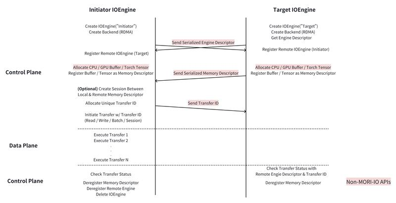
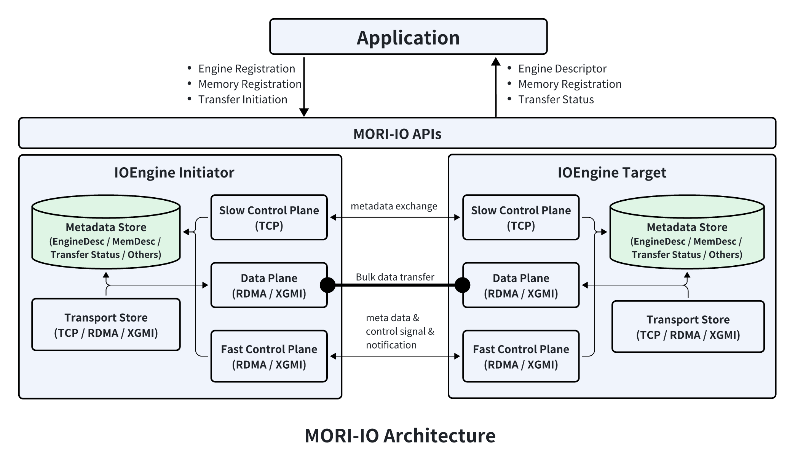

# MORI-IO Introduction

MORI-IO is AMD's point-to-point communication library that leverages GDR (GPU Direct RDMA) to achieve low-latency and high-bandwidth. Its current main use case is KVCache transfer in LLM inference.

## Design & Concepts
- **IOEgnine**: The primary interface for interacting with MORI-IO, it abstracts low-level details of p2p communications and provides high-level APIs for engine registration, memory registration, p2p transfer and etc.
- **Backend**: A backend represents and manages a specific transfer medium (e.g., PCIe, xGMI, IB). It must be created before any data transfer can occur over that medium.
- **Engine Registration**: Before two engines can communicate, the remote engine must be registered with the local engine. This establishes the necessary context for initiating data transfers between them.
- **Memory Registration**: Application memory must be registered with a local engine before it can participate in data transfer. This ensures the engine can access and manage the memory efficiently during communication.
- **Read/Write**: One-sided transfer operations initiated by the initiator engine without active involvement from the target engine. These operations can move data directly between registered memory regions.
- **Batch Read/Write**: A batched form of one-sided operations, where multiple transfers are grouped and launched together. Batching reduces per-operation launch overhead and improves bandwidth utilization.
- **Session**: A pre-established transfer context between a pair of MemoryDesc objects. Sessions eliminate repetitive overheads such as connection setup, metadata exchange, and resource management, providing a lightweight and efficient path for repeated transfers.

## Workflow
The image below shows a typical workflow of using MORI-IO.

## Architecture
The image below shows the architecture of MORI-IO.

From application's perspective, MORI-IO provides 3 kinds of functionalities, they are engine registration, memory registration and transfers.

The application is responsible for passing and registering engine descriptors among engines where transfers are expected to happen. Once engines are registered with each others, the application registgers memory buffers on both initiator-side and target-side. Before initiating transfers from initiator, the application need to first pass the memory descriptors from target side to initiator side. After that, the application is ready to initiate transfers from initiator engine. The transfer APIs will return a TransferStatus that application can use to query the state of corresponding transfers. Note that transfers are initiated in an asynchronous fashion.

Inside MORI-IO, there're 5 components: Slow Control Plane, Fast Control Plane, Data Plane, Metadata Store and Transport Store.

- **Slow Control Plane**: this component is used to exchange meta data such as memory descriptor, RDMA QP numbers, custom notification messages(TBD) and etc. MORI-IO implemented a TCP server and a light-weight protocol(no 3rdparty libraries required) for it.
- **Fast Control Plane**: this components is used to exchange meta data that is required in the critical path of transfers. An example is remote engine completion notifications. For single-side transfer operations such as READ/WRITE, the memory buffer on target side can only be reused or released after the target engine is notified with completion notification. To reduce the performance penalty of this process, MORI-IO utilize RDMA network.
- **Data Plane**: this component is used to transfer bulk data, current supported transport is RDMA, TCP and XGMI is in WIP state.
- **Metadata Store**: this component is used to manage meta data for each engine. MORI-IO does not have a centralized meta data store, instead each engine manages its own meta data through this component.
- **Transport Store**: this component is used to manage multiple transfer backend such as RDMA, TCP and XGMI. In case one of them is in failure state, MORI-IO switch to others.

