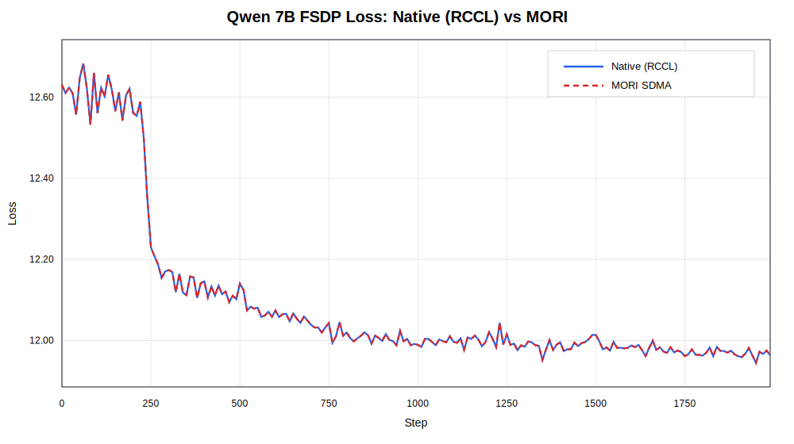
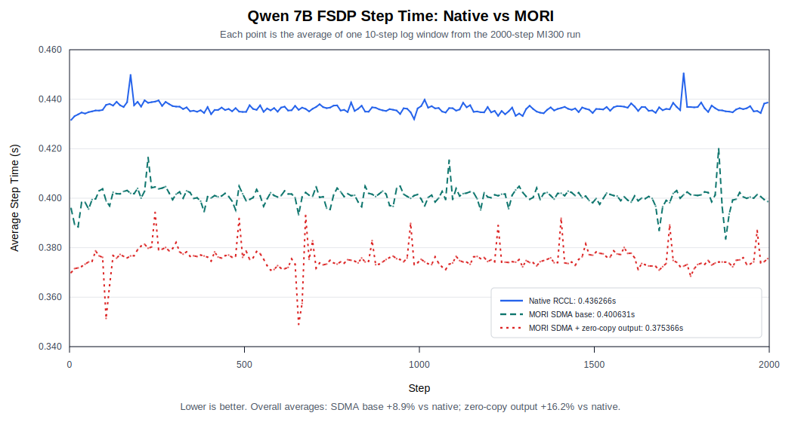
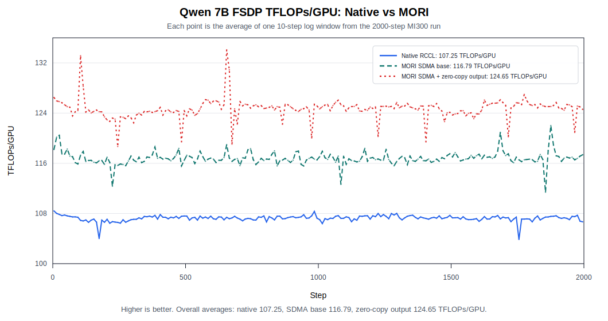

# MORI FSDP SDMA Allgather Optimization

This note summarizes the MORI SDMA allgather optimization for PyTorch FSDP2 and the
Qwen 7B benchmark results used to evaluate it. The focus is the end-to-end impact of
replacing the native RCCL allgather plus FSDP copy-out path with MORI SDMA and a
param-contiguous output layout.

## Background

FSDP2 frequently allgathers sharded parameters before forward and backward computation.
For large models, this path includes both inter-GPU communication and local tensor
layout work. The local layout work becomes noticeable for multi-parameter FSDP groups:
after the rank-major allgather completes, FSDP still has to split and copy the gathered
buffer into per-parameter full tensors.

The MORI integration reduces this overhead in stages:

1. Use MORI SDMA for the allgather communication path.
2. Register direct output buffers so SDMA can write into user-visible GPU memory.
3. Skip input copies when a single contiguous input can be used directly.
4. Add a param-contiguous multi-parameter no-copy output path.

## Runtime Modes

The benchmarks compare three execution modes. The native mode establishes the RCCL
baseline, the MORI SDMA base path isolates the communication replacement, and the
param-contiguous mode measures the full no-copy output path.

Native baseline (RCCL):

```bash
torchrun --nproc_per_node=8 examples/fsdp/bench_qwen7b_allgather.py \
  --mode native \
  --seq-len 1024 \
  --steps 2000 \
  --warmup 5
```

MORI SDMA base path:

```bash
MORI_ENABLE_SDMA=1 \
torchrun --nproc_per_node=8 examples/fsdp/bench_qwen7b_allgather.py \
  --mode mori \
  --seq-len 1024 \
  --steps 500 \
  --warmup 5
```

MORI SDMA with param-contiguous multi-parameter no-copy:

```bash
MORI_ENABLE_SDMA=1 \
MORI_FSDP_PARAM_CONTIGUOUS=1 \
torchrun --nproc_per_node=8 examples/fsdp/bench_qwen7b_allgather.py \
  --mode mori \
  --seq-len 1024 \
  --steps 2000 \
  --warmup 5
```

`MORI_FSDP_PARAM_CONTIGUOUS=1` is intentionally explicit. Without it, MORI still uses
the SDMA allgather path, but multi-parameter FSDP groups fall back to the safer copy-out
layout path.

## Benchmark Results

The headline comparison is between the native RCCL baseline and MORI SDMA with the
param-contiguous output path enabled. The run was measured on MI300 using Qwen 7B,
BF16, 8 GPUs, sequence length 1024, and micro-batch size 1.

First, the fixed-seed native (RCCL) and MORI loss curves overlap exactly:



This figure is the main correctness signal for the benchmark. With the same seed and
batch sequence, the optimized MORI path follows the native RCCL baseline without visible
loss drift over the full benchmark window.

The step-time comparison then shows the end-to-end speedup:



This figure shows that the MORI param-contiguous path consistently lowers per-step
latency, reducing average step time from `0.350888 s` to `0.313019 s`.

The TFLOPs/GPU comparison shows the same improvement from the throughput side:



This figure shows that lower communication and layout overhead translate into higher GPU
efficiency, increasing average throughput from `133.35` to `149.48` TFLOPs/GPU.

| Mode | Avg step time | Avg tokens/s | Avg TFLOPs | Avg TFLOPs/GPU | Final loss | Gain vs native |
| --- | ---: | ---: | ---: | ---: | ---: | ---: |
| Native baseline (RCCL) | `0.350888 s` | `23346.47` | `1066.79` | `133.35` | `11.96355152130127` | baseline |
| MORI SDMA + param-contiguous | `0.313019 s` | `26170.93` | `1195.85` | `149.48` | `11.96355152130127` | about `12.1%` |

The result is a roughly `12.1%` end-to-end speedup while preserving the final loss for
the fixed-seed benchmark.

## Optimization Progression

The full gain comes from two layers of optimization. The base MORI SDMA path improves
the communication side, while the param-contiguous path modifies the SDMA allgather
operator so it can write directly into the multi-parameter param-contiguous layout,
removing the remaining copy-out/layout transform after allgather.

| Mode | Environment | Main optimization | Avg step time | Gain vs native |
| --- | --- | --- | ---: | ---: |
| Native baseline (RCCL) | unset | RCCL allgather with standard FSDP copy-out | `0.350888 s` | baseline |
| MORI SDMA base path | `MORI_ENABLE_SDMA=1` | SDMA allgather with registered output buffers and reduced staging overhead | about `0.335 s` | about `4-5%` |
| MORI SDMA + param-contiguous | `MORI_ENABLE_SDMA=1` + `MORI_FSDP_PARAM_CONTIGUOUS=1` | SDMA allgather operator writes directly into multi-parameter param-contiguous output, removing copy-out | `0.313019 s` | about `12.1%` |

In short, the optimization path is:

```text
Native RCCL baseline
  -> MORI_ENABLE_SDMA=1
     -> faster SDMA allgather path, about 4-5% gain
  -> MORI_ENABLE_SDMA=1 + MORI_FSDP_PARAM_CONTIGUOUS=1
     -> SDMA allgather plus direct param-contiguous output, about 12.1% gain
```

## Implementation and Operator-Level Changes

The optimization has two parts: FSDP2 integration and a matching SDMA allgather operator
layout. FSDP2 decides when the MORI path can be used, and the SDMA operator writes the
allgather result into the layout that FSDP2 can consume without a copy-out step.

### FSDP2 Integration

In the FSDP2 `fully_shard` path, the integration point is the parameter group's
`AllGather` communication object. During parameter-group initialization, the default
`dist.all_gather_into_tensor` wrapper is replaced by `MoriSdmaAllGather` when the MORI
FSDP SDMA path is enabled:

```python
self._all_gather_comm: AllGather = (
    MoriSdmaAllGather() if is_mori_fsdp_sdma_enabled() else DefaultAllGather()
)
```

After that, the normal FSDP2 unshard flow still calls `foreach_all_gather()`, but the
communication primitive behind the call is MORI SDMA. This keeps the integration local
to the FSDP2 collective path instead of changing the higher-level module hooks:

```python
all_gather_work = all_gather_comm(
    output_tensor=all_gather_output,
    input_tensor=all_gather_input,
    group=group,
    async_op=async_op,
)
```

Inside `foreach_all_gather()`, FSDP2 first flattens the per-parameter allgather inputs
and records their split sizes. Those split sizes are the metadata MORI needs to produce
param-contiguous output:

```python
inp_split_sizes = [t.numel() for t in all_gather_inputs]
param_contiguous_output = _can_use_param_contiguous_all_gather_output(...)
if param_contiguous_output:
    param_contiguous_output = all_gather_comm.prepare_param_contiguous_output(
        inp_split_sizes,
        element_size=torch.empty((), dtype=dtype).element_size(),
        device=device,
    )
```

The integration adds three optimization points. First, MORI allocates and reuses a
registered GPU output buffer so SDMA can write directly into user-visible memory. Second,
for a single contiguous allgather input tensor, FSDP2 can skip the copy-in staging path
and pass the original input tensor directly to MORI. Third, for eligible multi-parameter
groups, FSDP2 passes per-parameter split sizes and offsets to MORI, enabling
param-contiguous output and skipping the normal `split_with_sizes_copy` copy-out.

The param-contiguous path is intentionally gated. It is used only for FSDP2 parameter
groups that have multiple parameters, shard on dim 0, do not use DTensor, do not define
custom `fsdp_post_all_gather`, and have one allgather input per parameter:

```python
if len(fsdp_params) <= 1:
    return False
for fsdp_param, input_numels, input_dtypes in zip(...):
    if fsdp_param.fsdp_placement.dim != 0:
        return False
    if fsdp_param.is_dtensor:
        return False
    if hasattr(fsdp_param._sharded_local_tensor, "fsdp_post_all_gather"):
        return False
    if len(input_numels) != 1 or len(input_dtypes) != 1:
        return False
```

Groups that do not satisfy these conditions can still use MORI SDMA allgather, but they
fall back to the regular rank-major output layout and FSDP2 copy-out path.

The gate is needed because the direct-write path turns the SDMA output buffer into the
backing storage for FSDP2 unsharded parameter views. That is only safe when each
parameter maps to one contiguous input split and the final `[param][rank]` layout matches
FSDP2's view construction. If a parameter uses a different shard dimension, DTensor
placement, custom post-allgather hook, or multiple allgather inputs, the same offset
formula may no longer describe the final parameter layout. In those cases, falling back
to the regular copy-out path preserves correctness.

For the Qwen 7B benchmark, the gate fully matches the observed FSDP2 allgather pattern:
every measured FSDP2 allgather output used the param-contiguous no-copy path.

### SDMA AG Operator-Level Changes

At the operator level, the param-contiguous path changes where each rank's shard is
written. Instead of first producing a rank-major buffer and then asking FSDP to copy it
into per-parameter outputs, MORI uses the split metadata to write each parameter shard
directly into the final param-contiguous layout.

The output layout changes from:

```text
rank-major:
  [rank0 param0 param1 ...][rank1 param0 param1 ...]

param-contiguous:
  [param0 rank0 rank1 ...][param1 rank0 rank1 ...]
```

For each parameter split, the SDMA kernel computes the destination offset as:

```text
output_offset = split_offset * world_size + rank * split_size
```

This means every rank writes its local shard into the correct per-parameter block on
every peer. After the allgather completes, FSDP2 can create each full parameter as a
cheap `narrow()` view of the MORI output buffer, so the normal `split_with_sizes_copy`
copy-out is skipped. Each view keeps its `storage_offset()`, so non-first parameters
still point to the right place inside the shared output buffer.

This turns the original sequence:

```text
allgather -> split_with_sizes_copy -> per-parameter full buffers
```

into:

```text
SDMA allgather directly into param-contiguous layout -> per-parameter views
```

This is the mechanism behind the measured speedup: the optimized path reduces both copy
bandwidth and launch/layout overhead while keeping the parameter views aligned with the
shared allgather output buffer.
