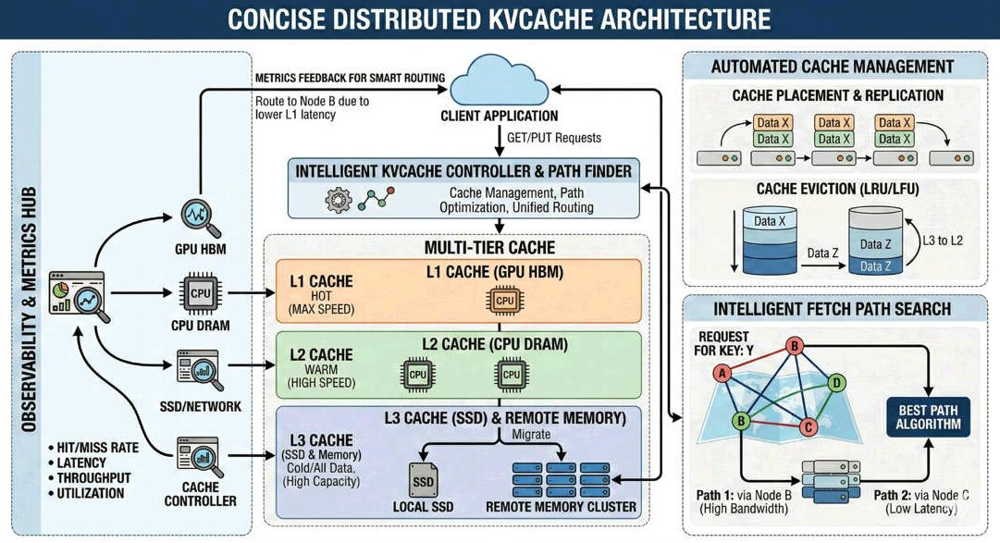

# [RFC] MORI-UMBP: A Scheduler-Codesigned, Policy-Pluggable Multi-Tier KV Cache Backend for SGLang

- **Status:** Draft
- **Author(s):** MORI team (AMD)
- **Tracking:** mori `src/umbp/`, sglang `python/sglang/srt/mem_cache/storage/umbp/`

---

## 1. Summary

This RFC proposes integrating **MORI-UMBP** (Unified Memory & Bandwidth Pool —
the tiered-storage, distributed KV component of AMD's MORI library) into SGLang
as a HiCache L3 storage backend **plus** a KV-event feed that the
request scheduler/router can consult.

Existing L3 backends (file, Mooncake, NIXL, HF3FS, …) are passive byte stores:
SGLang pushes pages down and pulls pages up, and everything the system knows
about cache placement, temperature, and access economics is invisible to the
layer that needs it most — the scheduler. UMBP differs in four ways:

1. **Scheduler-friendly, co-designed with mori-sched.** The UMBP master is a
   cluster-wide KV placement directory covering *all* tiers (engine HBM, host
   DRAM, UMBP DRAM pool, SSD). Beyond placement, it exposes per-key historical
   access counts, routing hit counters, last-access time, per-node
   capacity/utilization, access bandwidth histograms, and RPC latency — so a
   router can build a real *cost model*: not just "who has the prefix" but
   "who can serve it fastest".

2. **Customizable KV cache management policy.** Offload (put-routing), load
   (get-routing), eviction, and (planned) replication are pluggable strategy
   interfaces. Policy authors get access to the same rich metrics, so cache
   management becomes a developer surface instead of a hard-coded LRU.

3. **(WIP) Agent-aware hints.** TTL, session pinning, and priority hints flow
   from the serving API through HiCache into UMBP, so agentic workloads with
   known revisit patterns can shape cache retention explicitly.

4. **AMD hardware affinity by design.** UMBP explores software–hardware codesign opportunities with AMD GPU/CPU/NIC — examples include IBGDA and SDMA transports, GPU Direct Storage, and GPU-initiated NVMe.

The data plane already runs daily in our PD-disaggregation benchmarks
(`--hicache-storage-backend mori`). This RFC documents the design and proposes
the remaining integration work in phases.



---

## 2. Design

### Architecture

```
  request (+ agent hints: ttl / session_id / pin / priority)        ◄── Pillar 3 (WIP)
      │
      ▼
┌──────────────────────────────────────────────────────────────────┐
│            Router (mori-sched / sgl-model-gateway)               │
│                                                                  │ ◄── Pillar 1
│  score(worker) = α·Σ_tier(matched_tokens[tier]·tier_speedup)     │     scheduler
│                − β·queue_tokens − γ·tier_pressure − δ·fetch_eta  │     co-design
└──────────────┬───────────────────────────────────────────────────┘
               │ MatchExternalKv (per-node, per-tier prefix match;
               │   count_as_hit trains the hit index)
               │ GetExternalKvHitCounts / capacity & bw snapshots
               ▼
┌──────────────────────────────────────────────────────────────────┐
│                       UMBP Master (gRPC)                         │
│                                                                  │
│  Placement & history (scheduler cost-model inputs)    ◄── Pillar 1
│   ├─ ExternalKvBlockIndex   engine L1 HBM / L2 DRAM placement    │
│   ├─ GlobalBlockIndex       UMBP DRAM/HBM/SSD placement          │
│   │                         + BlockMetrics{access_cnt, recency}  │
│   ├─ ExternalKvHitIndex     historical per-hash hit counters     │
│   └─ Prometheus             per-node capacity/utilization,       │
│                             route counters, bandwidth, latency   │
│                                                                  │
│  Pluggable policies (PolicyContext = metrics above)   ◄── Pillar 2
│   ├─ RouteGetStrategy       load routing  (default: HBM>DRAM>SSD)│
│   ├─ RoutePutStrategy       offload routing (default: most-avail)│
│   ├─ EvictionManager        eviction (default: lease-aware LRU;  │
│   │                         radix depth via BatchPutWithDepth)   │
│   └─ ReplicationPolicy      (planned: hit-count-driven copies)   │
│                                                                  │
│  Hint-aware retention                                 ◄── Pillar 3 (WIP)
│   └─ TTL / session pin / priority consumed by eviction &         │
│      replication; session close → bulk revoke                    │
└───────────▲──────────────▲─────────────────────▲─────────────────┘
  heartbeat │   KV events  │ report/revoke       │ heartbeat
┌───────────┴───┐      ┌───┴───────────┐     ┌───┴───────────┐
│ SGLang engine │      │ SGLang engine │     │ SGLang engine │
│ L1 HBM radix  │      │      ...      │     │      ...      │
│ L2 host pool ←┼── UMBPHostTensorAllocator (hugepage/NUMA)  │ ◄── Pillar 4
│ L3 UMBPStore ─┼── IUMBPClient ── peer DRAM pool + SSD tier │     AMD HW
└───────────────┘        RDMA data plane (zero-copy)         │     affinity
   codesign examples: IBGDA / SDMA transport · GPU Direct Storage · GPU-initiated NVMe
```

The L3 data path (`UMBPStore` ↔ `IUMBPClient`, zero-copy RDMA) and the KV-event
feed (KV events ↔ master ↔ router) are decoupled: each is useful alone, and
together they close the loop — engine reports placement → master indexes and
accumulates history → router routes on the cost model (Pillar 1) → routing
trains the hit history → placement / eviction / replication policies consume
it (Pillar 2) → agent hints override where the workload knows better
(Pillar 3). A prefix that fell out of every engine's HBM but survives in the
UMBP pool remains routable and is fetched from the nearest replica over RDMA
instead of being recomputed. The whole loop rides on a data plane codesigned
with AMD hardware (Pillar 4).

---

## 3. Implementation details

This section describes the current state of the integration, which runs in our
fork and is exercised daily by the PD-disaggregation benchmarks. Everything in
§3.1–§3.5 is implemented; §3.6 lists the work still pending.

### 3.1 Where the code lives

| Concern | SGLang touchpoint | Backing MORI call |
| --- | --- | --- |
| L3 byte store | `mem_cache/storage/umbp/umbp_store.py` (`UMBPStore`) | `BatchGet` / `BatchPut` / `BatchExistsConsecutive` |
| L2 host buffer | `memory_pool_host.py` (`UMBPHostTensorAllocator` hook) | host KV tensor registration |
| KV-event feed | `KVEventsSubscriber` in `umbp_store.py` ← `ZmqEventPublisher` (no engine changes) | master external-KV index |
| Routing | mori-sched (`umbp_cache_aware` policy) | master query per request |

The backend is registered as `mori` in `StorageBackendFactory` and selected
with `--hicache-storage-backend mori`. The whole integration is flag-gated and
import-guarded, so a build without UMBP is unaffected.

### 3.2 L3 backend (`UMBPStore`)

- **Interface.** Implements the zero-copy v1 `HiCacheStorage` interface:
  - `batch_exists` → `BatchExistsConsecutive` (the prefetch probe).
  - `batch_get_v1` / `batch_set_v1` → pointer-based `BatchGet` / `BatchPut`
    issued directly against the host KV page buffers (no intermediate copy).
- **Key scheme.** Key construction and MHA / MLA / split-heads handling mirror
  `MooncakeStore`, so existing layouts are reused rather than reinvented.
- **Compatibility.** Existing write / prefetch policy knobs are unchanged.

### 3.3 Deployment modes

- **Standalone (default).** Per-rank local DRAM + SSD with automatic rank isolation (per-rank SSD dirs, MLA+TP shared-SSD leader/follower, DP+SPDK tenant quotas).
- **Distributed (`master_address` set).** Each rank joins the master-led pool with a per-rank identity, the host KV buffer registered once for RDMA zero-copy (staging-buffer fallback for capped-MR NICs), `dram_page_size` auto-derived so one Put/Get = one page = one RDMA op, and cross-DP-rank duplicate puts deduped by the master.

### 3.4 L2 host allocator

Opt-in `UMBPHostTensorAllocator` hook in `memory_pool_host.py`. It allocates a
hugepage-backed, NUMA-bound, prefaulted host KV tensor. Beyond the allocation
itself, this layout is what makes the one-shot RDMA registration (§3.3) reliable
on AINIC / ROCm.

### 3.5 KV-event feed

With `kv_events_subscriber=true`, the `KVEventsSubscriber` in `umbp_store.py` mirrors L1/L2 `BlockStored`/`BlockRemoved` events from SGLang's existing `ZmqEventPublisher` into the master's external-KV index (no engine changes); mori-sched reads it back via `MatchExternalKv` for the `umbp_cache_aware` routing policy, closing the Pillar-1 loop.

---

## 4. TODO

- [ ] **Benchmark results.** Publish end-to-end numbers (hit rate, TTFT / ITL, throughput) for UMBP vs. existing L3 backends across standalone/distributed modes and the HBM / DRAM / SSD tiers.

- [ ] **More test coverage.** Extend beyond smoke/unit tests to zero-copy get/set correctness across MHA / MLA / split-heads, depth-aware eviction, distributed multi-rank dedup + RDMA registration, and policy-interface conformance.

- [ ] **mori-scheduler integration.** Promote `umbp_cache_aware` from prefix-match to the full §2 cost model and wire the pluggable policies (Pillar 2) and agent hints (Pillar 3) through to mori-sched.
