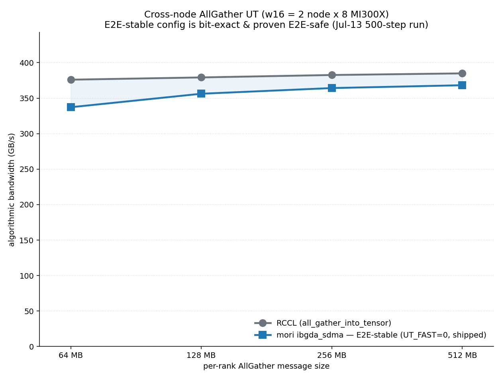
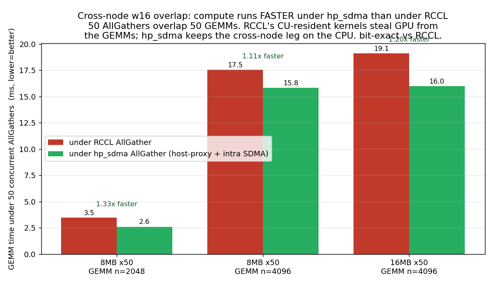
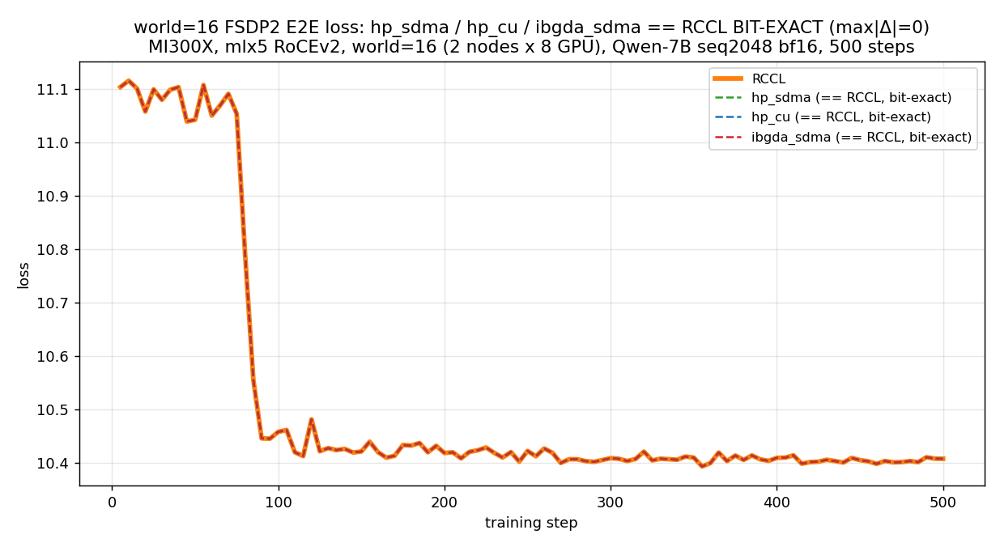
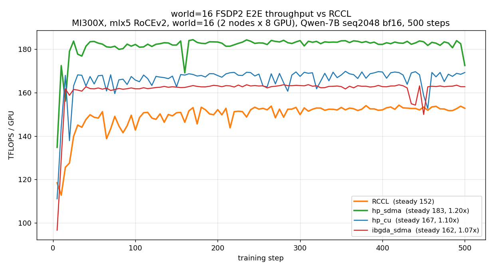

# ccl: hierarchical cross-node AllGather (intra-node SDMA + inter-node RDMA)

## Summary

Adds a hierarchical AllGather to MORI-CCL (`mori.ccl.HierAllGather`, an
`all_gather_into_tensor`-compatible collective) that keeps intra-node traffic on
the GPU **SDMA copy engines** (XGMI) and moves inter-node traffic over **RDMA**
(NIC).

Motivation is **compute/communication overlap**: the collective runs
on the dedicated SDMA copy engines instead of the compute units, so an AllGather
issued concurrently with a GEMM does not steal CUs from the GEMM — parity with
the native (non-SDMA) path standalone, and a strict win when overlapped with
compute.

## Design

- Intra-node phase: SDMA sub-group gather over XGMI (no CU usage, no NIC).
- Inter-node phase: RDMA ring exchange of node-blocks over the NIC.
- Fused `ring || local-gather` kernel: the inter-node RDMA ring and the
  ring-independent local node-block SDMA gather run concurrently in one grid,
  stream-ordered, direct-to-output (no staging copy).
- Correctness: **bit-exact** vs `torch.distributed.all_gather_into_tensor`
  (zero tolerance) for `{bf16, fp16, fp32, int32}`, all tested sizes.

## API

```python
from mori.ccl import HierAllGather

ag = HierAllGather(
    my_pe=rank, npes=world_size, ranks_per_node=local_world_size,
    input_buffer_size=per_rank_bytes,
    output_buffer_size=per_rank_bytes * world_size,
    copy_output_to_user=True,
)
ag(input_tensor, output_tensor, numel, stream)   # intra=SDMA, inter=RDMA
```

## Results (MI300X, mlx5 RoCEv2 — w16 = 2 node × 8 GPU; all bit-exact vs RCCL)

Raw logs, CSVs, and the plot scripts live under
[`bench/`](bench/). The standalone AllGather-bandwidth figure is regenerated
from that data by `plot_ag_perf.py` (see **Reproduce**); the overlap and E2E
figures below are captured artifacts from the runs whose raw logs are committed
alongside them.

### 1. Standalone AllGather bandwidth vs RCCL (E2E-stable config)

The default E2E construction (`MORI_HIER_UT_FAST=0`, device `ibgda_sdma`) is
bit-exact and tracks RCCL closely, converging as the message grows. A single
AllGather is **not** where the win is — the collective is network-bound and
GPU-light, so standalone bandwidth is near-parity, not a beat:

| per-rank size | ibgda_sdma / RCCL |
|--------------:|:-----------------:|
| 64 MB  | 0.90× |
| 128 MB | 0.94× |
| 256 MB | 0.95× |
| 512 MB | 0.96× |



### 2. GEMM time under concurrent AllGather (the no-CU-contention dividend)

Where the win actually comes from: RCCL's CU-resident AllGather kernels steal the
GPU from concurrent GEMMs; `hp_sdma` keeps the cross-node leg on the CPU and the
intra-node leg on the SDMA copy engine, so the GEMMs finish faster while 50
AllGathers run concurrently (lower = better, bit-exact vs RCCL):

| 50 AGs ‖ 50 GEMMs | RCCL | hp_sdma | speedup |
|---|--:|--:|:--:|
| 8 MB,  GEMM n=2048 | 3.5 ms  | 2.6 ms  | 1.33× |
| 8 MB,  GEMM n=4096 | 17.5 ms | 15.8 ms | 1.11× |
| 16 MB, GEMM n=4096 | 19.1 ms | 16.0 ms | 1.20× |



### 3. End-to-end FSDP2 (Qwen-7B, seq 2048, w16) — drop-in MoriAllGather

Training loss is bit-identical to the native run over the whole curve while step
throughput beats the framework default. Three mori variants (intra × inter leg):

| variant | inter-node leg | intra-node leg | throughput vs RCCL |
|---|---|---|--:|
| `hp_sdma`    | host-proxy (CPU-posted RDMA) | SDMA (XGMI, CU-free) | ~1.20× |
| `hp_cu`      | host-proxy                   | NCCL (CU)            | ~1.10× |
| `ibgda_sdma` | device IBGDA (GPU-posted RDMA) | SDMA               | ~1.07× |




## Default path

The **default path** — what every FSDP/E2E caller gets with no `MORI_HIER_*`
env set — is:

- **Sliced 2-D AllGather**: inter-node RDMA ring over same-local-index peers
  exchanging one shard/NIC, then N intra-node SDMA reassembly gathers. The
  bit-exact bandwidth path.
- **Fused Phase-B** with stream-ordered ring/intra barriers and deferred finish
  fences.
- CU-domain copy-out, with the two cross-PE finish fences forced ON at
  `ranks_per_node >= 8` (the w16 config) for bit-exactness.

This raw library default needs no env var. On top of it the FSDP adapter
(`mori_allgather.py`) applies **zero-tuning defaults** for cross-node
(`num_nodes >= 8` layouts) — enabled via `setdefault`, so any explicit `MORI_*`
still wins.

### Shipped env (what the `bench/scripts/run_*.sh` three-state configs set)

The reproduce scripts are the source of truth; each knob below is part of a
bit-exact shipped path (verified against RCCL), not a diagnostic. Per E2E variant
(`run_e2e.sh`, on top of `MORI_ENABLE_SDMA=1 MORI_FSDP_ENABLE_HIER=1`):

| variant | env it sets |
|---|---|
| `hp_sdma` | `MORI_FSDP_HOST_PROXY=1 MORI_FSDP_HOSTPROXY_CAP_MB=512 MORI_HOSTPROXY_ASYNC=1 MORI_HOSTPROXY_SDMA_INTRA=1` |
| `hp_cu`   | `MORI_FSDP_HOST_PROXY=1 MORI_FSDP_HOSTPROXY_CAP_MB=512 MORI_HOSTPROXY_ASYNC=1` |
| `ibgda_sdma` | `MORI_HIER_DEBUG_SYNC=0` (device IBGDA leg; no host proxy) |

The FSDP adapter additionally turns on the CU-free fused fill for cross-node —
`MORI_HIER_FUSE_LOCAL=1 MORI_HIER_FUSE_REMOTE=1 MORI_HIER_LOCAL_PUSHONLY=1`, plus
`MORI_HIER_DEBUG_SYNC=1 MORI_HIER_CUDA_GRAPH=0` at `ranks_per_node >= 8` as the
bit-exact landing fence (`ibgda_sdma` overrides it back to `0`). This is exactly
the `run_ut_ag_perf.sh e2e` construction, which is bit-exact and E2E-safe.

Env overrides always win, so any default above can be flipped.

## Second platform (MI355X + AINIC / ionic)

A parallel w16 FSDP2 E2E result set on AMD **MI355X** GPUs with the **AINIC
(ionic)** RoCEv2 NIC is under
[`bench/results/mi355x_ainic/`](bench/results/mi355x_ainic/) — same `run_e2e.sh`
script with the ionic node pair / NIC env, headline ~1.08× TFLOPS/GPU vs native
with bit-identical loss. See the figures there.

## Reproduce

All launchers live in `bench/scripts/`. Each one drives the 2-node run itself
(ssh into master + worker, clear stale procs, start `torchrun`); the UT sources
are in `tests/python/ccl/`. The node pair / NIC list is at the top of each script
(env-overridable: `MASTER`/`WORKER`/`IFACE`/`MORI_RDMA_DEVICES`/…). Raw logs +
figures land under `bench/results/mi300x_mlx5/`.

```bash
cd examples/fsdp_sdma/bench/scripts

# 1) Standalone AllGather bandwidth UT (device ibgda_sdma vs RCCL)
#    -> ../results/mi300x_mlx5/ag_perf_e2e_stable_w16.png
bash run_ut_ag_perf.sh e2e  64 128 256 512   # E2E-stable (default) config
python ../results/mi300x_mlx5/raw/plot_ag_perf.py   # (re)draw the figure from the run (or committed CSV)

# 2) Compute/comm overlap UT (GEMM time under 50 concurrent AGs, hp_sdma vs RCCL)
#    -> ../results/mi300x_mlx5/overlap_w16_gemm_time.png   (args: gemm_n size_mb nops)
bash run_ut_overlap.sh 2048  8 50
bash run_ut_overlap.sh 4096  8 50
bash run_ut_overlap.sh 4096 16 50

# 3) End-to-end FSDP2 (Qwen-7B): RCCL baseline + one mori variant, bit-exact loss + tflops
bash run_e2e.sh              # RCCL + hp_sdma (default)
bash run_e2e.sh hp_cu
bash run_e2e.sh ibgda_sdma
WORLD=w8 bash run_e2e.sh     # world=8 (default w16)
```

## Test plan

- [x] Bit-exact vs `torch.distributed.all_gather_into_tensor` for
      `{bf16, fp16, fp32, int32}` on every tested size (true 2-node, world=8 & 16).
- [x] Standalone AllGather bandwidth sweep, E2E-stable config (near-parity, bit-exact).
- [x] Compute/comm overlap UT — GEMM finishes 1.1–1.3× faster under 50 concurrent AGs.
- [x] End-to-end FSDP2 training, loss bit-identical to native at world=8 & 16.
