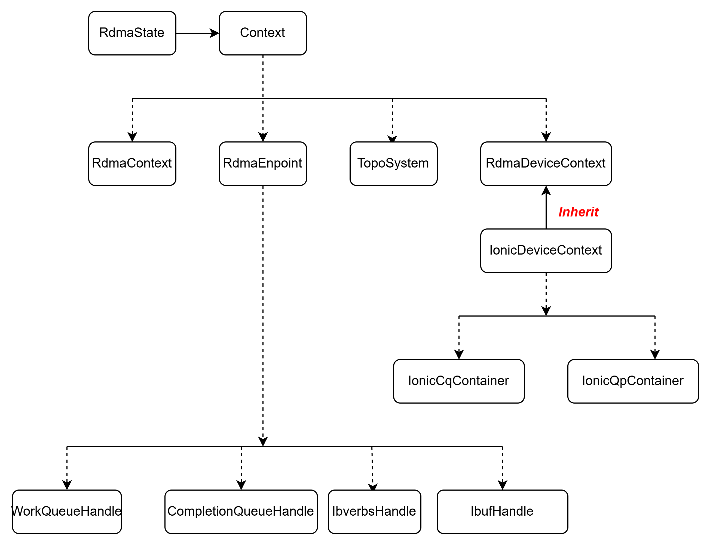

# Mori RDMA Subsystem — AINIC (Ionic) Implementation

## 1. Overview

Mori's RDMA subsystem enables **GPU-initiated network I/O** — the GPU directly constructs and submits RDMA work requests without CPU involvement. This is the foundation for Mori-SHMEM `put`/`get`/`atomic` operations in GPU kernels.

Standard libibverbs requires CPU to post work requests. IBGDA (InfiniBand GPU Direct Async) bypasses this by exposing the NIC's hardware queues (SQ, RQ, CQ, Doorbell registers) directly to GPU memory space, allowing HIP kernels to construct WQEs and ring doorbells.

## 2. RDMA Class Hierarchy
See this pic 

```
struct RdmaStates // top-level structure of rdma subsystem
  |── application::Context* 


Context // RDMA subsystem 
  |── std::unique_ptr<RdmaContext>
  |── std::unique_ptr<RdmaDeviceContext>
  |── std::vector<RdmaEndpoint>
  |── std::unique_ptr<TopoSystem>


RdmaContext                       // top-level, enumerates all NICs 
  |──std::vector<RdmaDevice*>   // one per RNIC

/* RdmaDevice holds the identity and capabilities of a physical 
 * NIC (which device, how many ports, attributes of each port)
 * it describes the RDMA hardware but without QPs' abstractions
 */
RdmaDevice                          // single NIC
  ├── ibv_device*
  ├── ibv_context*
  ├── map<uint32_t, std::unique_ptr<ibv_port_attr>> // record attributes of each port
  └── std::unique_ptr<ibv_device_attr_ex> // device attribute

RdmaDeviceContext  //  Base class for all RDMA NIC providers (Ionic, MLX5, BNXT)
  ├── ibv_pd*
  ├── ibv_srq*
  ├── RdmaDevice* 
  └── map<void*, ibv_mr*>           // MR pool


/* Holds all QPs and CQs all Pesando RDMA NIC
 */
IonicDeviceContext : RdmaDeviceContext
  ├── std::unordered_map<uint32_t, IonicCqContainer*>            
  └── std::unordered_map<uint32_t, IonicQpContainer*>


IonicCqContainer     
  ├── uint32_t cqn
  ├── void* cqDbrUmemAddr
  ├── void* cqUmemAddr
  ├── void* cqUmem
  ├── void* cqDbrUmem
  ├── void* cqUar
  ├── void* cqUarPtr
  └── ibv_cq* cq              


/* List the part of members of this class
 */ 
IonicQpContainer
  ├── size_t qpn
  ├── uint16_t wqeNum
  ├── uint64_t* gpu_db_cq
  ├── uint64_t* gpu_db_sq
  ├── uint64_t* gpu_db_rq
  ├── size_t atomicIbufSize
  ├── void* atomicIbufAddr
  └── ibv_mr* atomicIbufMr atomicIbufAddr   // atomic result buffer


RdmaEndpoint // Pure POD data structure, can be copied with hipMemcy
  ├── core::WorkQueueHandle wqHandle               // SQ/RQ addrs, doorbell, tracking indices
  ├── core::CompletionQueueHandle cqHandle         // CQ addr, consumer index, doorbell
  ├── core::IBVerbsHandle ibvHandle;                // ibv_qp*/ibv_cq* (host fallback)
  └── core::IbufHandle atomicIbuf;                // atomic buffer addr + lkey
```

## 3. Shmem Initialization & RDMA Bring-up Flow

Goal: create IBVerbs objects (QP, CQ, MR), extract their HW addresses, and make them GPU-accessible — so GPU kernels can post RDMA WQEs without CPU.

### 3.1 Top-level Call Chain

```
ShmemInit(bootNet)  // (init.cpp)
  ├── InitializeBootStates()  // (rank, worldSize)
  ├── RdmaStatesInit()
  │     └── new Context(bootNet)  // (context.cpp)
  │           ├── CollectHostNames()  // (allgather hostnames, determine locality)
  │           └── InitializePossibleTransports()  // (*** core RDMA init, see 3.2 ***)
  ├── MemoryStatesInit()  // (SymmMemManager, heap VMM or static)
  └── GpuStateInit()
        ├── CopyTransportTypesToGpu()  // (TransportType[] → device)
        ├── CopyRdmaEndpointsToGpu()  // (RdmaEndpoint[] → device, hipMemcpy)
        ├── ConfigureHeapInfoForGpu()  // (heap base/end/chunkSize → GpuStates)
        ├── AllocateInternalSync()  // (barrier sync buffer)
        └── CopyGpuStatesToDevice()  // (hipMemcpyToSymbol globalGpuStates)
```

### 3.2 InitializePossibleTransports — RDMA Path Detail

This is the core of RDMA setup. For each peer, decide transport type (P2P/SDMA/RDMA), create endpoints, exchange handles, and connect QPs.

```
InitializePossibleTransports()  // (context.cpp)
  │
  ├── new RdmaContext(DirectVerbs)  // (1. enumerate all RNICs)
  ├── TopoSystem::MatchGpuAndNic(deviceId)  // (1. PCIe topology → pick closest NIC)
  ├── device->CreateRdmaDeviceContext()  // (1. *** see 3.3 ***)
  │
  ├── for each peer:  // (2. decide transport & create endpoints)
  │     ├── same node? → TransportType::P2P (or SDMA)
  │     └── remote?    → TransportType::RDMA
  │           └── rdmaDeviceContext->CreateRdmaEndpoint()  // (*** see 3.4 ***, x numQpPerPe)
  │
  ├── bootNet.AllToAll(localHandles, peerHandles)  // (3. exchange endpoint handles across all ranks)
  │
  └── for each RDMA peer, for each QP:  // (4. connect QPs)
        └── rdmaDeviceContext->ConnectEndpoint(local, remote)  // (*** see 3.5 ***)
```

### 3.3 CreateRdmaDeviceContext (Ionic)

Allocate PD with a **custom GPU memory allocator** so libibverbs places QP/CQ buffers in GPU memory.

```
IonicDevice::CreateRdmaDeviceContext()
  ├── ibv_alloc_pd(context)
  └── create_parent_domain(context, pd)  // (pattr.alloc = hipExtMallocWithFlags(Uncached), pattr.free = hipFree)
        ├── pd_uxdma[0] = ibv_alloc_parent_domain()  // (UDMA channel 0)
        └── pd_uxdma[1] = ibv_alloc_parent_domain()  // (UDMA channel 1)
```
Two parent domains bound to different UDMA channels (`ionic_dv_pd_set_udma_mask`), QPs round-robin across them.

### 3.4 CreateRdmaEndpoint (Ionic)

Create CQ + QP, extract raw HW pointers via Direct Verbs, map doorbell to GPU, assemble POD handle.

```
IonicDeviceContext::CreateRdmaEndpoint(config)
  ├── ibv_create_cq_ex()  // (a. Create CQ, CQE = maxCqeNum * 2)
  ├── ibv_create_qp_ex()  // (a. Create QP, RC, max_inline=32B, 1 SGE)
  ├── ionic_dv_get_ctx()  // (b. Extract HW ptrs: dvctx.db_page, host MMIO doorbell)
  ├── rocm_memory_lock_to_fine_grain(db_page)  // (b. Map doorbell → GPU-writable pointer)
  │     ├── gpu_db_sq  // (SQ doorbell = gpu_db_ptr[sq_qtype])
  │     ├── gpu_db_rq  // (RQ doorbell = gpu_db_ptr[rq_qtype])
  │     └── gpu_db_cq  // (CQ doorbell = gpu_db_ptr[cq_qtype])
  ├── ionic_dv_get_cq()  // (b. → cq buffer ptr, mask, db_val)
  ├── ionic_dv_get_qp()  // (b. → sq/rq buffer ptr, mask, db_val)
  ├── hipExtMallocWithFlags(ibufSize, Uncached)  // (c. Allocate atomic result buffer)
  ├── ibv_reg_mr(pd, ibuf, RW | REMOTE_ATOMIC)  // (c. Register atomic ibuf as MR)
  └── Assemble RdmaEndpoint  // (d. Pure POD, hipMemcpy to device)
        wqHandle   ← sqAddr, rqAddr, dbrAddr, sq_dbval, color
        cqHandle   ← cqAddr, cqeNum, cqeSize, cq_dbval
        atomicIbuf ← addr, lkey, rkey, nslots
```

**Why `rocm_memory_lock_to_fine_grain`?** NIC doorbell is host MMIO — GPU can't write it directly. HSA `hsa_amd_memory_lock_to_pool()` maps it into a GPU-visible fine-grained pool, so GPU threads can atomically write the doorbell.

**Why custom PD allocator?** Standard libibverbs allocates SQ/RQ/CQ buffers on host. Hooking `hipExtMallocWithFlags(Uncached)` makes them land on GPU memory, so GPU kernels read/write WQEs directly without DMA.

### 3.5 ConnectEndpoint — QP State Machine

```
ConnectEndpoint(local, remote)
  ├── ModifyRst2Init()    port, access_flags(RW | REMOTE_ATOMIC)
  ├── ModifyInit2Rtr()    remote QPN/PSN/GID, MTU
  └── ModifyRtr2Rts()     timeout=14, retry=7, rnr_retry=7, max_rd_atomic=15
```

After **RTS**, the QP is live. GPU kernels can construct WQEs and ring doorbells without CPU.