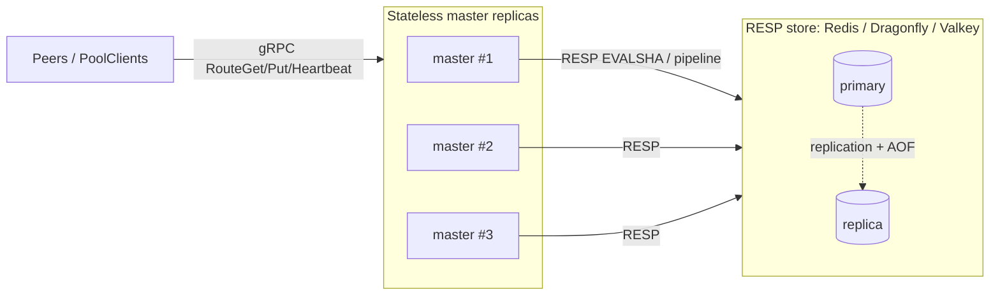

# UMBP Master — Redis / Dragonfly Metadata Store Design

**Scope:** A RESP-protocol-compatible backend for
`IMasterMetadataStore` (`src/umbp/include/umbp/distributed/master/master_metadata_store.h`)
that makes the UMBP master **stateless**: all client/block/external-KV/hit
metadata lives in an external RESP store (Redis, Dragonfly, or Valkey), and
master processes only accept RPCs, query the store, and return data. Fault
tolerance is delegated to the store's replication + persistence.

**Companion doc:** [`design-master-control-plane.md`](./design-master-control-plane.md)
is authoritative for the master's RPC contract, router, eviction, and the
`InMemoryMasterMetadataStore` (the single-master / unit-test backend). This
doc only covers the Redis backend of the same interface.

**Status:** Phase 1 delivered — RESP client seam (hiredis), key schema, Lua
hot-path scripts, `RedisMasterMetadataStore` (six hot methods + the methods the
running master needs), the `MakeMasterMetadataStore` factory, and a
backend-selectable microbench. Conformance passes on Redis and Dragonfly. See
the go/no-go results in
[`redis-backend-phase1-bench.md`](./redis-backend-phase1-bench.md); Phase 2
directions are in that report's §5.

---

## 1. Goals and non-goals

### Goals

1. **Stateless master.** Any number of master replicas can serve traffic
   concurrently; each holds no durable state. A crashed master restarts and
   reads the full picture back from the store. This is the split-brain fix
   the interface header already calls out: today `GlobalBlockIndex`,
   `ClientRegistry`, `ExternalKvBlockIndex`, `ExternalKvHitIndex` are
   in-process `unordered_map`s, so a second master replica immediately
   diverges.
2. **RESP + Lua common subset.** One implementation, swappable across
   Redis / Dragonfly / Valkey by connection config only. We program to the
   intersection of what all three support over the RESP wire: strings /
   hashes / sets / sorted-sets, `MULTI`-free single-key atomics, pipelines,
   and server-side `EVAL` / `EVALSHA` Lua.
3. **Single round trip per RPC.** Every hot method is one network round trip
   (a pipeline or a single Lua `EVALSHA`); no N-round-trip loops. The
   interface was designed for this (`Batch*` methods, and the
   "implementations SHOULD make each read a single backend round-trip"
   contract).
4. **Fault tolerance via the store.** AOF/replication + failover in the store
   is the durability and HA mechanism. The master adds reconnect/backoff and
   fails RPCs cleanly (`UNAVAILABLE`) rather than serving stale local data.

### Non-goals

- No change to the master RPC contract, router, eviction policy, or peer.
  The only production wiring change is the store construction line in
  `master_server.cpp`.
- No KV data-plane involvement. Pages stay on peers; the master (and thus the
  store) holds metadata only.
- No SQL backend. The read path does one store round-trip per RouteGet with a
  Lua lookup+lease+access; that is fine on Redis and ruinous on an OLTP DB.

---

## 2. Where it plugs in

`MasterServer` owns a single `std::unique_ptr<IMasterMetadataStore>` and hands
references to the router, service, and eviction manager. Today it is
hard-wired to the in-memory impl:

```774:777:src/umbp/distributed/master/master_server.cpp
    : config_(std::move(config)),
      store_(std::make_unique<InMemoryMasterMetadataStore>()),
      router_(*store_, std::move(config_.get_strategy), std::move(config_.put_strategy)),
      service_(std::make_unique<UMBPMasterServiceImpl>(*store_, router_, config_.registry_config,
```

The only production change: replace the `make_unique<InMemoryMasterMetadataStore>()`
with a factory `MakeMasterMetadataStore(config)` that returns either the
in-memory or the Redis impl based on `UMBP_METADATA_BACKEND`. Everything
downstream (`router_`, `service_`, `eviction_manager_`, reaper, hit-GC loops)
is untouched because they only see `IMasterMetadataStore&`.



### The hot path is narrow

`router.cpp` uses only these store methods on the RouteGet / RoutePut path:

```73:93:src/umbp/distributed/routing/router.cpp
  auto exists_mask = store_.BatchExistsBlock(keys);
  auto candidates = store_.ListAliveClients();
  ...
  auto node_to_peer = store_.GetAlivePeerView();
  ...
  auto all_locs = store_.BatchLookupBlockForRouteGet(
```

Plus the write hot path `ApplyHeartbeat` and the (cold-ish) `RegisterClient`.
These six methods decide the whole backend's performance and are the entire
Phase 1 scope:

- `BatchExistsBlock` (RoutePut dedup)
- `ListAliveClients` (RoutePut candidate set)
- `GetAlivePeerView` (RouteGet node -> peer_address projection)
- `BatchLookupBlockForRouteGet` (RouteGet lookup + lease + access, batched)
- `ApplyHeartbeat` (index update, seq-CAS)
- `RegisterClient`

---

## 3. RESP compatibility strategy

We do **not** couple to any redis-server-only feature. The portable substrate
is:

- Data types: `STRING`, `HASH`, `SET`, `ZSET`.
- Commands: `HSET/HGET/HGETALL/HDEL/HINCRBY`, `SADD/SREM/SMEMBERS/SCARD`,
  `ZADD/ZRANGEBYSCORE/ZREM`, `EXISTS`, `DEL`, `EXPIRE`, plus `EVAL/EVALSHA/SCRIPT LOAD`.
- Pipelining for the pure-read fan-outs (`ListAliveClients`, `GetAlivePeerView`).
- Server-side Lua for every multi-key atomic mutation.

### Atomicity contract (the key tension)

The interface header requires several methods to be atomic across former store
boundaries (`ApplyHeartbeat`, `UnregisterClient`, `ExpireStaleClients`,
`RegisterExternalKvIfAlive`, and the hit-counting branch of `MatchExternalKv`).
We satisfy this with **one Lua script per such method**, and we make the script
cross-key-atomic by co-locating all keys in **one hash slot** via a shared hash
tag (see [KeySchema](#4-keyschema)). Then:

| Deployment | Cross-key Lua atomicity | Notes |
| --- | --- | --- |
| Redis single node | Yes (single-threaded) | Baseline; strongest guarantee |
| Redis Cluster | Yes, **iff** all keys share one slot | Hash tag guarantees this; a stray cross-slot key -> `CROSSSLOT` error |
| Valkey | Same as Redis | RESP + Lua semantics match Redis |
| Dragonfly | Yes within a script over same-slot keys | Multi-threaded engine; Lua runs atomically, but we still verify with the conformance race tests, not by assumption |

Design rule: **all keys touched by one script share the deployment hash tag**,
so every script runs in a single slot and stays atomic on all four
deployments. This is why we do NOT split the interface into three stores; a
single tagged keyspace lets one script mutate node + block + extkv together.

Determinism: scripts never call `redis.call('TIME')` or `randomkey`; every
timestamp is passed in from the caller as `now_ms` (`system_clock` epoch
milliseconds; see hazard #7 in the interface header). This keeps scripts
replication-safe regardless of the store's replication mode.

---

## 4. KeySchema

Two hash-tag families, split so block lookups can scale past one slot:

- **Control tag** `H = {umbp:<namespace>}` (`<namespace>` from
  `UMBP_REDIS_NAMESPACE`, default `default`): client records, ALIVE set, peer
  projection, and the per-node reverse indexes all co-locate here so one Lua
  script mutates them atomically.
- **Block-shard tags** `Bs = {umbp:<namespace>:bS}` for `S in [0, N)` where
  `N = UMBP_REDIS_BLOCK_SHARDS`: a block key is placed under the shard chosen by
  a stable hash (FNV-1a) of the user key. Spreading blocks over `N` slots is
  what lets `BatchLookupBlockForRouteGet` / `BatchExistsBlock` run one
  single-slot script per shard instead of piling every lookup onto one slot /
  one server thread. **`N == 1` collapses `Bs` back onto `H`, so the emitted key
  strings are byte-identical to the original single-tag schema.**

| Purpose | Key | Type | Fields / members |
| --- | --- | --- | --- |
| Client record | `H:node:<id>` | HASH | `addr`, `peer`, `status` (1=ALIVE,2=EXPIRED), `last_hb`, `reg_at`, `seq`, `caps`, `engine`, `tags` |
| Alive membership | `H:nodes:alive` | SET | `<id>` for every ALIVE node |
| Alive peer projection | `H:alive_peers` | HASH | `<id>` -> `peer_address` (ALIVE only) |
| Block locations | `Bs:block:<key>` | HASH | `l\|<node>\|<tier>` -> `size`; meta `_lease`, `_lacc`, `_acnt`, `_created` |
| Node -> its block keys | `H:node:<id>:blocks` | SET | full `Bs:block:<key>` strings (reverse index for node-scoped wipe) |
| External-KV entry | `H:extkv:<hash>` | HASH | `<node>` -> tier bitmask (bit per `TierType`) |
| Node -> its extkv hashes | `H:extkv:node:<id>` | SET | `<hash>` (reverse index) |
| Hit counter | `H:hit:<hash>` | HASH | `c` (count), `ls` (last_seen ms) |
| Eviction LRU index | `H:lru:<node>:<tier>` | ZSET | member `<key>`, score `last_accessed_ms` |

Sharding notes:

- The per-node reverse index stays a single set on the control tag, but its
  **members are now full (already-sharded) block-key strings**. The caller
  (`KeySchema::Block`) composes the block key and hands it to the write scripts,
  and the wipe scripts (full_sync / unregister / expire) drain those members and
  `HDEL` them directly — no shard math in Lua.
- **Atomicity when `N > 1`**: each block key is still mutated / read atomically
  in one single-slot script, but a batch read is no longer a whole-batch
  snapshot (it is one single-slot script per shard). This matches the in-memory
  backend, whose block index is likewise key-hashed shards read under per-shard
  locks; the interface only promises per-key semantics.
- **Write scripts vs. Redis Cluster**: `apply_heartbeat` / `unregister` /
  `expire` touch the control tag AND block keys across shards in one script,
  which is valid on a single instance (non-cluster Redis, or Dragonfly with
  `allow-undeclared-keys`) but would `CROSSSLOT` on Redis Cluster. Splitting
  those writes into a control script + per-shard block scripts (with idempotent
  replay) is the documented next step for cluster / multi-endpoint fan-out; the
  read hot path is already single-slot per script.

### 4.1 Multi-endpoint mode (horizontal scaling)

A single Redis instance is single-threaded, so splitting block lookups into more
scripts on ONE instance does not raise throughput (it lowers per-script cost but
runs more scripts on the same thread — measured flat/slightly-worse). The only
way past that ceiling is to put block shards on **different Redis instances**.

`UMBP_REDIS_SHARD_URIS` gives one instance per block shard (shard count = number
of URIs). `clients_[0]` (the first URI) is the **control instance**: it holds
all control-plane keys (`node:`, `nodes:alive`, `alive_peers`, `extkv:`) plus
block shard 0. Block shard `s` lives on `clients_[s]` under tag `{umbp:<ns>:bs}`,
with its own per-node reverse index `{umbp:<ns>:bs}:node:<id>:blocks` co-located
on that instance.

Because no Lua script can span instances, the cross-store writes are split:

| Method | Control instance step | Per-shard-instance step |
| --- | --- | --- |
| `ApplyHeartbeat` | `apply_heartbeat_control` (seq-CAS + record + alive/peers) | `apply_block_events` on each shard with events (full_sync clears every shard) |
| `UnregisterClient` | `unregister_control` (record + alive + peers + extkv) | `wipe_node_blocks` on every shard |
| `ExpireStaleClients` | `expire_control` (flip status, return dead ids) | `wipe_node_blocks` per dead node per shard |

The control step runs first, then the block steps. Block ADD/REMOVE, full_sync
clear+replay, and node-wipe are all **idempotent**, so a failed/retried block
step is safe; a partial failure surfaces as an exception, the peer retries, the
next heartbeat seq-gaps, and `full_sync` heals the node's locations wholesale.
This is the same "atomic per key/shard, not globally atomic" posture the
in-memory backend already documents. Reads (`BatchLookupBlockForRouteGet`,
`BatchExistsBlock`) group keys by shard and issue one `EvalPipeline` per instance
(sequential today; throughput still scales because the master serves many
RouteGets concurrently). Single-endpoint mode (no `UMBP_REDIS_SHARD_URIS`) keeps
the original single atomic scripts unchanged.

Notes:

- **Timestamps** are `system_clock` epoch milliseconds (int64), never
  `steady_clock`. They cross the process boundary and must be meaningful after
  restart and across replicas (hazard #7).
- **`caps`** encodes `std::map<TierType,TierCapacity>` as
  `tier:total:avail;tier:total:avail;...`.
- **`tags`** is `\n`-joined (tag values contain `=`, e.g. `sgl_role=prefill`,
  so `=`/`,` are unsafe separators; `\n` is not used inside tags).
- **`engine`** stores `engine_desc_bytes` raw (RESP is binary-safe).
- The block hash mixes location fields (`l|node|tier`) and meta fields
  (`_`-prefixed) in **one key** so a RouteGet touches exactly one key and the
  lookup+lease+access is a single-key atomic in Lua.
- **`alive_peers`** exists so `GetAlivePeerView` is one `HGETALL`, and
  `nodes:alive` exists so `AliveClientCount` is one `SCARD`. Both are
  projections maintained by the same scripts that flip status.

---

## 5. Method -> RESP/Lua mapping

Legend: **RT** = round trips. **P** = pipeline. **L** = single Lua `EVALSHA`.

### 5.1 Hot read path

| Method | Impl | RT |
| --- | --- | --- |
| `BatchExistsBlock` | Lua: for each `H:block:<k>` return `EXISTS && HLEN(location fields)>0` (a key with only meta fields but no locations is "absent") | 1 (L) |
| `ListAliveClients` | `SMEMBERS H:nodes:alive`, then pipelined `HGETALL H:node:<id>` per member; decode records | 2 (P) |
| `GetAlivePeerView` | `HGETALL H:alive_peers` | 1 |
| `BatchLookupBlockForRouteGet` | Lua `route_get_batch` (see [6.1](#61-route_get_batch)) | 1 (L) |
| `AliveClientCount` | `SCARD H:nodes:alive` | 1 |
| `GetPeerAddress` | `HGET H:node:<id> peer` | 1 |
| `IsClientAlive` | `HGET H:node:<id> status` == 1 | 1 |
| `GetClient` | `HGETALL H:node:<id>` + decode | 1 |
| `GetClientTags` | `HGET H:node:<id> tags` | 1 |
| `LookupBlock` | `HGETALL H:block:<key>`, project location fields (no lease/access) | 1 |

### 5.2 Hot write path

| Method | Impl | RT |
| --- | --- | --- |
| `ApplyHeartbeat` | Lua `apply_heartbeat` (seq-CAS + record update + block ADD/REMOVE or full replace + reverse index + `nodes:alive`/`alive_peers` + `lru` maintenance) | 1 (L) |
| `RegisterClient` | Lua `register_client` (TTL-stale/EXPIRED revive CAS + write record + `nodes:alive`/`alive_peers`) | 1 (L) |

### 5.3 Cascading writes and external-KV

| Method | Impl | RT |
| --- | --- | --- |
| `UnregisterClient` | Lua: `DEL H:node:<id>`, `SREM nodes:alive`, `HDEL alive_peers`, drain `H:node:<id>:blocks` deleting each block's node fields + `H:extkv:node:<id>` reverse wipe | 1 (L) |
| `ExpireStaleClients` | Lua: scan `nodes:alive`, for each with `last_hb < cutoff` flip status EXPIRED, `SREM nodes:alive`, `HDEL alive_peers`, wipe its blocks + extkv; return dead node ids | 1 (L) |
| `RegisterExternalKvIfAlive` | Lua: check `HGET H:node:<id> status`==1; if alive, for each hash set tier bit in `H:extkv:<hash>` + `SADD H:extkv:node:<id>` | 1 (L) |
| `UnregisterExternalKv` | Lua: clear tier bit for (node,hash) pairs; drop empty entries + reverse-index members | 1 (L) |
| `UnregisterExternalKvByTier` | Lua over `H:extkv:node:<id>` members | 1 (L) |
| `UnregisterExternalKvByNode` | Lua over `H:extkv:node:<id>`, then `DEL` it | 1 (L) |
| `MatchExternalKv` | Lua `match_external_kv`: for each hash read `H:extkv:<hash>`, group by node/tier; if `count_as_hit`, `HINCRBY H:hit:<hash> c 1` + set `ls=now` for each unique matched hash | 1 (L) |
| `GetExternalKvHitCounts` | pipelined `HGET H:hit:<hash> c` | 1 (P) |
| `GetExternalKvCount` | `SCARD H:extkv:node:<id>` | 1 |
| `GarbageCollectHits` | Lua/`SCAN`-driven: drop `H:hit:*` whose `ls < cutoff` (see [note](#8-scan-caveat)) | bounded |
| `EnumerateEvictionCandidates` | Lua `enumerate_eviction`: per `H:lru:<node>:<tier>` ZSET, `ZRANGEBYSCORE` ascending, `HGET` each block's `_lease`, skip leased, collect up to `max_per_bucket` | 1 (L) |

---

## 6. Hot-path Lua scripts (Phase 1)

Representative pseudo-Lua; the final scripts are Phase 1 deliverables in
`src/umbp/distributed/master/redis/lua_scripts.h`. All scripts receive the hash
tag prefix as `ARGV[1]` so they can compose auxiliary key names
(`lru`, reverse indexes) that stay in the same slot.

### 6.1 route_get_batch

Mirrors `BatchLookupBlockForRouteGet`: locations are returned only for keys
with at least one non-excluded location, and only those keys get a lease +
access bump (fully-excluded / absent keys are untouched, matching the in-memory
impl at `in_memory_master_metadata_store.cpp:490-497`).

```lua
-- KEYS[1..n] = H:block:<userkey>
-- ARGV[1]=prefix H, ARGV[2]=now_ms, ARGV[3]=lease_ms,
-- ARGV[4]=n_exclude, ARGV[5..]=exclude node ids,
-- then trailing ARGV = the n raw user keys (for lru members)
local out = {}
for i = 1, #KEYS do
  local fields = redis.call('HGETALL', KEYS[i])   -- flat [f,v,f,v,...]
  local locs, touched = {}, false
  for j = 1, #fields, 2 do
    local f, v = fields[j], fields[j+1]
    if f:sub(1,2) == 'l|' then                     -- 'l|<node>|<tier>'
      local node, tier = parse_loc_field(f)
      if not excluded(node) then
        locs[#locs+1] = { node, tonumber(v), tier }
        touched = true
      end
    end
  end
  if touched then
    redis.call('HSET', KEYS[i], '_lease', now_ms + lease_ms, '_lacc', now_ms)
    redis.call('HINCRBY', KEYS[i], '_acnt', 1)
    for _, loc in ipairs(locs) do                  -- maintain per-bucket LRU
      redis.call('ZADD', prefix..':lru:'..loc[1]..':'..loc[3], now_ms, userkey_i)
    end
  end
  out[i] = locs
end
return out
```

### 6.2 apply_heartbeat

Mirrors `ApplyHeartbeat` (`in_memory_master_metadata_store.cpp:323-372`),
including the three hazards: seq-CAS (#1), status stays ALIVE on `SEQ_GAP`
without advancing seq/caps, full_sync atomic replace (#payload-sizing bound),
delta ADD/REMOVE with reverse-index + LRU maintenance.

```lua
-- KEYS[1] = H:node:<id>
-- ARGV: prefix, node_id, seq, now_ms, is_full_sync, caps_blob,
--       n_events, then per-event {kind,key,tier,size}
local rec = redis.call('HGETALL', KEYS[1])
if #rec == 0 then return {'UNKNOWN', 0} end
local last = tonumber(hget(rec,'seq'))
if is_full_sync == 0 and seq ~= last + 1 then
  redis.call('HSET', KEYS[1], 'last_hb', now_ms, 'status', 1)
  redis.call('SADD', prefix..':nodes:alive', node_id)
  return {'SEQ_GAP', last}                          -- caps/seq NOT advanced
end
redis.call('HSET', KEYS[1], 'last_hb', now_ms, 'status', 1, 'seq', seq, 'caps', caps_blob)
redis.call('SADD', prefix..':nodes:alive', node_id)
redis.call('HSET', prefix..':alive_peers', node_id, hget(rec,'peer'))
if is_full_sync == 1 then
  wipe_node_blocks(prefix, node_id)                 -- drain node:<id>:blocks
  for each ADD event do add_location(...) end       -- REMOVE ignored on full_sync
else
  for each event do apply_add_or_remove(...) end     -- maintains reverse index + lru
end
return {'APPLIED', seq}
```

### 6.3 register_client

Mirrors `RegisterClient` (`in_memory_master_metadata_store.cpp:263-303`):
reject only an ALIVE, non-stale record; revive EXPIRED or TTL-stale ALIVE.

```lua
-- KEYS[1]=H:node:<id>; ARGV: prefix, node_id, now_ms, stale_after_ms, <record fields...>
local rec = redis.call('HGETALL', KEYS[1])
if #rec > 0 then
  local status, last_hb = tonumber(hget(rec,'status')), tonumber(hget(rec,'last_hb'))
  local stale = (now_ms - last_hb > stale_after_ms) or (status == 2)
  if status == 1 and not stale then return 0 end     -- reject live re-register
end
redis.call('HSET', KEYS[1], 'status',1,'last_hb',now_ms,'reg_at',now_ms,'seq',0, <fields>)
redis.call('SADD', prefix..':nodes:alive', node_id)
redis.call('HSET', prefix..':alive_peers', node_id, peer)
return 1
```

---

## 7. Fault tolerance

- **Master crash / scale-out.** All durable AND volatile master state (records,
  block locations, leases, LRU, hit counts) is in the store. A restarted or new
  master reads it back; no warm-up, no per-replica drift. This is the entire
  point of moving state behind the interface.
- **Store persistence.** Recommend AOF `appendfsync everysec` + at least one
  replica. On Dragonfly, periodic snapshot + replica. The master relies on the
  store's own HA (Sentinel / Cluster failover / Dragonfly replication).
- **Connection layer** (`RespClient`): connection pool sized to the gRPC
  handler concurrency; per-call socket timeout; exponential-backoff reconnect;
  automatic `SCRIPT LOAD` re-registration on `NOSCRIPT`; `EVALSHA` -> `EVAL`
  fallback.
- **Degradation.** If the store is unreachable, the affected RPC returns
  `grpc::UNAVAILABLE` (never fabricated / stale data). A readiness probe reports
  the master unhealthy while the store is down, so load balancers drain it.
- **Multi-master safety.** All mutations go through Lua/CAS (no process-local
  locks), so N masters against one store cannot split-brain. Verified by the
  conformance race tests (reader vs in-flight full_sync/heartbeat asserts
  old-or-new, never torn; never resolves a peer for an unregistered node).

---

## 8. Known caveats

- **full_sync payload sizing.** A full_sync from a peer with millions of keys is
  one Lua script of that size, which blocks the (single-threaded) Redis server
  for its whole duration. Per the interface `TODO(payload-sizing)`, full_sync
  MUST be atomic, so the mitigation is on the peer: cap full_sync batch size
  (proposed 100k events) and fragment larger resyncs. Documented as a peer-side
  follow-up; the store enforces atomicity per call.
- <a id="8-scan-caveat"></a>**`GarbageCollectHits` / hit-key enumeration.** There
  is no reverse index over all hit keys. `GarbageCollectHits` uses `SCAN
  MATCH H:hit:*` in bounded batches (cursor-based, non-atomic across batches),
  which is acceptable because it runs on a slow GC timer, not the hot path.
- **Dragonfly Lua atomicity** is validated by the conformance race suite, not
  assumed. If a divergence surfaces, the fallback is to gate the Redis-backend
  "multi-master" claim to Redis/Valkey and treat Dragonfly as single-writer.
- **Hot-path cost shift.** Every RouteGet moves from an in-process
  `shared_mutex` read (nanoseconds) to a network + Lua round trip
  (microseconds-to-milliseconds). Whether this is acceptable is exactly what
  Phase 1 measures.

---

## 9. Connection / client library

- **Client:** `redis-plus-plus` (on `hiredis`). It covers RESP2/3, pipelines,
  Lua (`EVAL/EVALSHA/SCRIPT LOAD`), connection pooling, and Redis Cluster, and
  connects unchanged to Dragonfly and Valkey.
- **Build:** introduced under `3rdparty/` (submodule or CMake `FetchContent`),
  behind `option(USE_REDIS_BACKEND ... OFF)` so existing builds are unaffected
  until explicitly enabled.
- **`RespClient` seam** (`redis/resp_client.h`): a thin wrapper exposing
  `Eval/EvalSha/ScriptLoad`, `Pipeline`, and pooled connections. It isolates
  redis-plus-plus so the store code depends on a small interface, and so a raw
  `hiredis` or cluster client can be swapped in without touching the store.

---

## 10. Environment variables

| Var | Default | Meaning |
| --- | --- | --- |
| `UMBP_METADATA_BACKEND` | `inmemory` | `inmemory` or `redis` |
| `UMBP_REDIS_URI` | (none) | e.g. `tcp://127.0.0.1:6379`; comma list for cluster seeds |
| `UMBP_REDIS_NAMESPACE` | `default` | deployment id used inside the hash tag `{umbp:<ns>}` |
| `UMBP_REDIS_CLUSTER` | `0` | `1` to use the cluster client |
| `UMBP_REDIS_SHARD_URIS` | (none) | comma-separated Redis URIs for **multi-endpoint** mode: one instance per block shard, so their scripts run on independent server processes/threads. This is the way past a single instance's single-thread ceiling — measured ~2.9x RouteGet throughput at 4 instances on a dedicated host (`M1 t16 ~5.2k -> M4 t16 ~15k ops/s`), with M1 flat at the single-slot ceiling. When set (>1 URI) it supersedes `UMBP_REDIS_BLOCK_SHARDS`. The first URI is the control instance. See §4.1. |
| `UMBP_REDIS_BLOCK_SHARDS` | `1` | single-endpoint only: number of hash-tag shards the block keyspace is spread over. `1` = legacy single-tag layout (byte-identical keys, whole-batch-atomic reads). `>1` spreads block lookups across slots (helps a threaded store / cluster, no gain on one single-threaded Redis). Fixed for a deployment's lifetime; clamped to `[1, 4096]`; `<=0` → `1`. See §4. |
| `UMBP_REDIS_POOL_SIZE` | (cpu-derived) | connection pool size |
| `UMBP_REDIS_CONNECT_TIMEOUT_MS` | `1000` | connect timeout |
| `UMBP_REDIS_SOCKET_TIMEOUT_MS` | `1000` | per-command socket timeout |
| `UMBP_REDIS_PASSWORD` | (none) | auth (may also be in the URI) |

These follow the resolution semantics in
[`runtime-env-vars.md`](./runtime-env-vars.md) (cached at startup; one WARN per
invalid value).

---

## 11. Phasing

The whole approach lives or dies on hot-path latency against a real store, so
we validate that **before** implementing the full interface.

### Phase 0 — Design (this doc)

This document plus a cross-reference from `design-master-control-plane.md`.

### Phase 1 — Core vertical slice + performance comparison

- Introduce `redis-plus-plus` behind `USE_REDIS_BACKEND` (default OFF).
- `RespClient`, `KeySchema`, `RedisMasterMetadataStore` implementing only the
  six hot-path methods (§2). All other methods `throw
  std::logic_error("unimplemented (phase 1)")`.
- `MakeMasterMetadataStore(config)` factory + the one-line
  `master_server.cpp` change, gated on `UMBP_METADATA_BACKEND`.
- `tools/redis/docker-compose.yml`: single-node Redis 7 and Dragonfly.
- **Deliverable:** run the existing `bench_kvevent_master_pressure`
  (`tests/cpp/umbp/distributed/bench_kvevent_master_pressure.cpp`) with
  `UMBP_METADATA_BACKEND` = inmemory / redis / dragonfly and produce
  `docs/redis-backend-phase1-bench.md`: p50/p99 of `BatchRouteGet` /
  `Heartbeat`, throughput, and read-after-write miss rate. This is the go/no-go
  and optimization-direction signal.

### Phase 2 — Full implementation + fault tolerance

- Implement the remaining ~30 methods (external-KV, hit GC, eviction ZSET,
  reaper `ExpireStaleClients`, cascading unregister).
- Parameterize `test_in_memory_master_metadata_store.cpp` into a backend-agnostic
  conformance suite that runs against both in-memory and Redis (integration
  label; skipped where no Redis is available).
- Fault tolerance: reconnect/backoff, `NOSCRIPT`/`EVALSHA` fallback,
  `UNAVAILABLE` degradation, readiness probe.
- Multi-master: two master processes against one store passing the conformance
  race cases; kill-a-replica failover.
- Redis Cluster: assert same-slot for every scripted keyset; handle
  `MOVED`/`ASK` in the client.

---

## 12. Testing

- **Phase 1:** targeted unit tests for the six hot methods against a local Redis
  (integration label, skippable) + the bench report.
- **Phase 2:** the parameterized conformance suite (same assertions on in-memory
  and Redis), the reader-vs-full_sync race cases, and fault-injection tests
  (drop the connection mid-call, `NOSCRIPT`, replica failover).

---

## 13. Open decisions

1. **Client library:** `redis-plus-plus` (recommended) vs raw `hiredis`.
2. **Phase 1 backends:** Redis + Dragonfly (recommended) vs Redis-only first.
3. **Atomicity posture:** RESP+Lua common subset with single-instance strong
   atomicity and documented cluster/Dragonfly caveats (recommended) vs
   Redis-strict-first.

Defaults above are the recommended choices; adjust before Phase 1 code lands.
