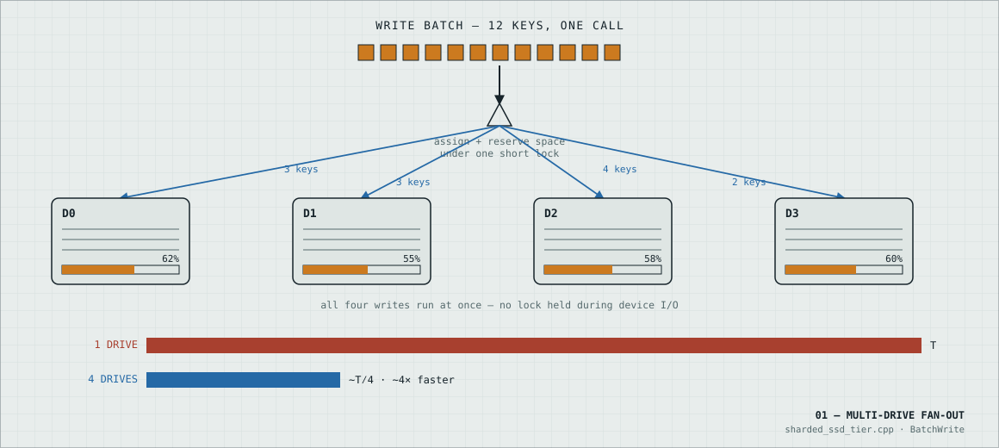
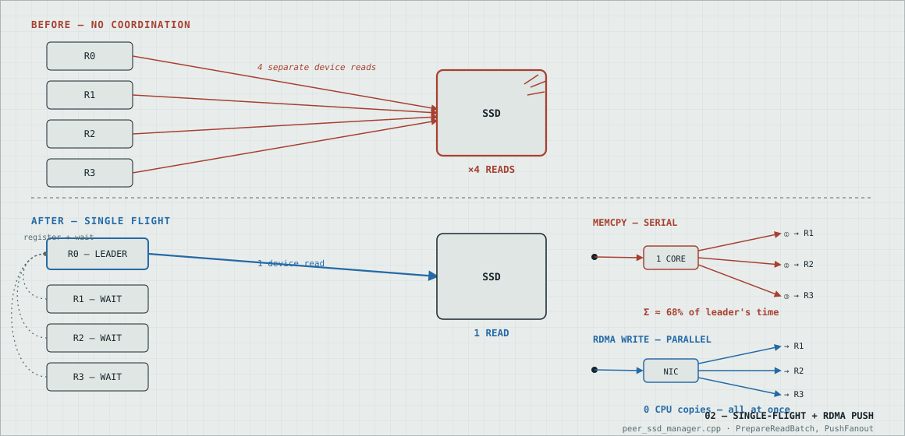
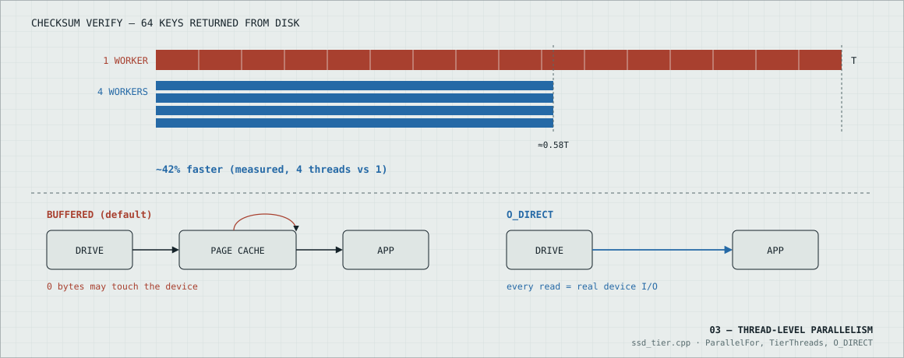
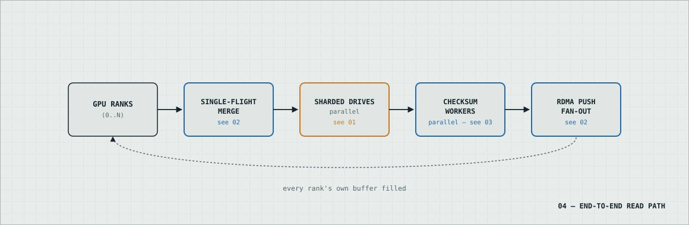

# How UMBP's multi-drive SSD tier works

Four diagrams, no prose to wade through. Amber = storage/drive domain, blue =
network / parallel delivery, brick = serial / contention / before-state.

For config knobs, validated numbers, and troubleshooting: [pure-ssd-mode.md](pure-ssd-mode.md).

## 01 — Multi-drive fan-out

A KV-cache page is stored as one **key**, and every key lives on exactly one
drive — never split across two. Spread a node's keys over several drives
instead of one, and a batch of reads or writes touches all of them at the
same time instead of queuing behind a single device.

Which drive a key gets is decided once, under a lock held just long enough
to reserve the space — never while bytes are actually moving. That's what
keeps four drives writing at once instead of one at a time.

## 02 — Single-flight + RDMA push

Tensor-parallel GPUs don't split the KV cache between them — every rank
needs the identical page for the same request. Left alone, that's N ranks
each independently pulling the same bytes off the same drive: N times the
device work for data that only needed to be read once.

Single-flight turns the first request into the one real read; everyone else
just waits on it. Handing them the result is a second cost — a one-core
memcpy loop can outrun the read itself, so the fast path writes into every
waiter's buffer over RDMA instead, all at once.

## 03 — Thread-level parallelism

Reading bytes off a drive is mostly waiting on the device. Verifying those
bytes weren't corrupted — the checksum step every read runs — is mostly CPU
work, and it turns out to cost more than the read itself. Unlike the read,
though, it's easy to split up: one key's checksum never depends on
another's.

Four workers instead of one core cuts checksum time by about 42%, measured.
O_DIRECT is a separate, complementary fix underneath it — it forces every
read through the actual device, so the numbers above describe the drive and
not a lucky page-cache hit.

## 04 — End-to-end read path

None of the three tricks above work alone — they chain together on every
single read UMBP serves, in a fixed order: de-dup first, then parallel
drives, then parallel CPU work, then parallel delivery. Each hop has its own
counter in the logs, so a stall in any one of them is easy to isolate.

Follow one request through: merge, then read, then verify, then deliver —
four independent wins stacked on the same call. That's also the order to
check, top to bottom, when a read is slower than it should be.

## 05 — L1 vs L2 vs L3, measured end-to-end

The three mechanisms above only cover the L3 (SSD) path. The natural next question: how much of
that speed actually reaches the request, next to the two cheaper tiers a hit could also come
from — L1 (GPU device radix cache, never leaves the node) and L2 (host DRAM, one PCIe hop)?

Measured on sglang HiCache, Kimi-K2.6-MXFP4, TP8, single fixed-length request per round. The
table's "request length" is the **prefix** length (4K/16K/…128K) — every request appends and
generates exactly **1** token on top of it, so the number below **is** TTFT, not a
prefill-plus-decode blend. Each tier isolated by forcing a resend to hit exactly one of L1 / L2 /
L3 and nothing else, verified against `/metrics` per-tier hit counters rather than trusted from
timing alone.

Two setup details mattered more than any single knob from sections 01-04 above:

- **The engine's own embedded SSD capacity was shrunk to 1 MB**, so it can never be
  capacity-selected as a put target itself — every real L3 read goes to dedicated standalone
  workers instead of leaking back to the engine node's own idle disk.
- **8 physical drives, 4 shards**, split 2 local (engine node) + 6 remote across 3 standalone
  workers on a second node — the same multi-drive fan-out from section 01, just with the shards
  living off-node behind RDMA instead of all local.

| Request length | Cold recompute | L1 hit | L2 hit | L3 hit |
|---|---|---|---|---|
| 4K | ≈0.18s | ≈0.10s | ≈0.20s | ≈0.14s |
| 16K | ≈0.73s | ≈0.12s | ≈0.20s | ≈0.20s |
| 32K | ≈1.42s | ≈0.14s | ≈0.21s | ≈0.27s |
| 128K | ≈7.7s | ≈0.29s | ≈0.45s | ≈0.84s |

L1 always wins. L3 closes almost all the way to L2 at small sizes — even beating it at 4K — but
the gap widens with length, since an L3 hit still pays for an SSD round trip that L2 skips
entirely. Cold recompute stays the slowest option at every size tested, by a growing margin: L3
is already ~1.3x faster than recompute at 4K, and ~9x faster by 128K.

## Terms, briefly

| Term | Meaning |
|---|---|
| Key | one KV-cache page's cache identity |
| Shard | one physical drive's slice of a node's SSD tier |
| Rank | one GPU process in a tensor-parallel group |
| Single flight | collapsing N identical concurrent requests into 1 read + N-1 waiters |
| RDMA write | the NIC moves bytes into a remote buffer — neither CPU does a copy |
| O_DIRECT | a file-open flag that skips the OS page cache entirely |
